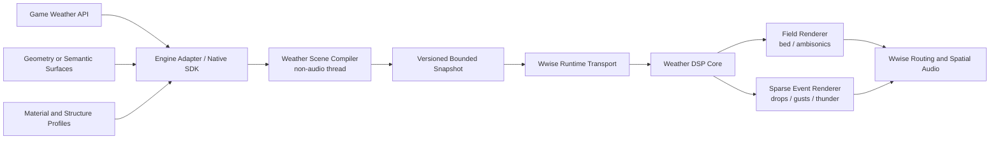
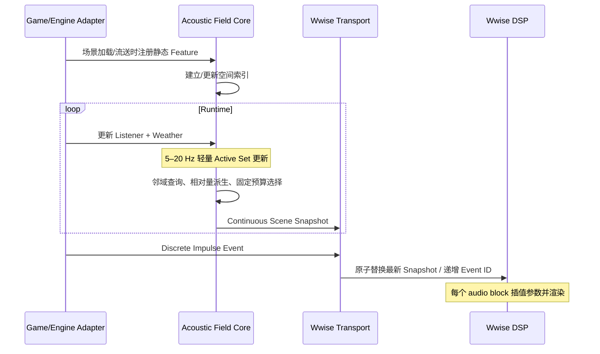

# Geometry-Conditioned Weather Acoustics for Wwise

## 文档状态

- 状态：持续讨论基线；v0.3 Hybrid Audio File Source + Geometry Effect 纵向切片已实现；v0.4 Listener-centered FOA Field 为待实施 POC，Wwise 2023.1 QA 与 Native Host 证据仅覆盖 v0.3
- 文档版本：v1.3
- 当前实现版本：v0.3 hybrid slice；当前计划版本：v0.4 Listener-centered FOA Field
- 创建时间：2026-07-21 15:52（Asia/Shanghai）
- 最后更新：2026-07-29（Asia/Shanghai）
- 讨论主题：基于游戏天气、几何与表面语义数据生成风、雨、雷暴声学的通用 Wwise 产品
- 当前结论：技术可行，产品价值成立；目标应是“物理启发、感知可信、跨引擎可接入”，而不是实时全物理仿真。

## 版本修订记录

### v1.3（v0.4 Listener-centered FOA Field 计划，尚未实现）

- 将当前目标收敛为两层：一条 Listener-centered FOA Far Field Bed 负责方向性环境衰减与频谱变化；有限数量的局部 Material Patch 负责雨伞、雨棚和近处表面的统计撞击纹理。
- 新增专用 `AmbiDirectionalMaskFX` 计划：只处理合法 FOA ACN/SN3D 信号，接收有上限的方向遮罩快照并在 Ambisonic 域做低/中/高频平滑处理。
- 明确 v0.3 Effect `PluginID=31002` 不能直接用于 FOA：其现有 wet 输出是按通道 0/1 的 Stereo 路由；可复用材质/颗粒算法和验证基础设施，但必须更换 FOA 输出路径。
- POC 先验证单墙、墙角与顶部雨棚的坐标链和听感收益，再决定是否实现 Mono `WeatherSurfaceGranulatorSource` 与更复杂几何；不以全物理建模或逐雨滴 Event 为目标。
- 该实施合同、Wwise 对象树、数据协议、Project_J 适配边界、性能门禁和验收标准见 `docs/V0_4_LISTENER_CENTERED_FOA_PLAN.md`。本产品计划的其他长期愿景不因此自动视为已实现。

### v1.2（v0.3 Hybrid Audio File Source + Geometry Effect 已实现切片）

- 保留现有 Source `PluginID=31001` 和旧/当前 Bank 参数 ABI；v0.1 `261` 字节 legacy block 与 v0.2 `273` 字节 current block 继续作为回归合同。
- 新增独立 Effect `PluginID=31002` 作为 v0.3 主路径：Wwise Audio File Source/streamed loop 提供高质量 rain/wind bed，Effect 添加几何与材质交互。
- Effect 当前参数契约为 `InputRole`、`WetMix`、`ResponseGainDb`、`TransientSensitivity`、weather/listener、`FeatureCount` 和 8 组 `X/Y/Z/Radius/Profile/Mask/Priority`；共 71 参数、281-byte Bank block。
- `InputRole` 值为 `Rain=0`、`Wind=1`、`Generic=2`，默认 `Generic`；`WetMix` 为 `0..1` 默认 `0`；`Priority` 为 `0..1000` 数值权重。
- Runtime C ABI 已导出 scene `Set/Get/Clear` 与 Diagnostics `Reset/Get`；scene 为 392 bytes，feature 为 40 bytes，Diagnostics V1 为 96 bytes，最多 8 槽。最终 Host 对 89 个 scene payload 字段做逐字段 roundtrip 比较。
- Baseline、InputRoleWetGeometry、WetZero 三个 Effect bank 和 Host 三态音频合同 matrix 已完成；正式 expectation 为 `changed`、`wet-bypass`、`geometry-disabled`，并有两份应失败负例验证门禁。
- Unity/Unreal Adapter、人工主观听感、高级 DSP 参数、完整 3D 几何和产品化 Monitor 仍为后续项。

### v1.1（v0.3 Hybrid Audio File Source + Geometry Effect 规格历史）

- 当时决策保留 Source `PluginID=31001` 和旧/当前 Bank 参数 ABI，并将新增能力放入独立 Effect `PluginID=31002`。
- 当时设想包含更宽的输入激励参数、频带权重、几何增益和 8 注册/4 激活预算；实际 v0.3 只实现了较窄的参数面，未实现 `EnvelopeSensitivity`、band weights、smoothing、distance scale 或 priority bias。
- 当时静态几何继续由游戏、Native Host 或引擎 Adapter 显式提交；实际 v0.3 已完成 Native Host scene C ABI，Unity/Unreal 仍未完成。

### v1.0（当前已实现基线）

- 完成独立产品工程、共享 C++ DSP Core、单元/离线 WAV 测试、Wwise 2023.1 Source Plug-in、参数后端、Win32 Authoring 2D Preview、隔离构建、最小 staging/install 与 WAAPI/Profiler smoke。
- 当前可执行切片承诺物理启发的程序化风声与基于输入音频的雨声表面响应：一个 Listener、最多 8 个 `SphereProxy` 固定槽位、`ActiveK=4`、Metal/Wood/Glass/Tile/Plastic 五个 Profile、立体声输出；`Plastic=4` 为追加值，旧 `0..3` 编号不变。
- Authoring Preview 已冻结为三个 Preset + 圆形列表/2D Canvas + 单个可拖动 Listener 点 + Yaw 箭头 + Feature/Surface 添加/删除/圆心拖动/半径手柄；没有 Listener Path，也没有 Preview-only 声学数据模型。Effect 雨声主面板只显示可直接试听的 `Rain Amount`、`Surface Mix`、`Impact Gain dB`、`Impact Sharpness`、`Geometry Response` 和 Surface 材质/响应控件；`Seed`、`ListenerY`、`Priority` 与风参数仍保留在 ABI/Bank/runtime 中。
- 固定 8 槽 PropertySet 是 Wwise 2023.1 首轮验证用兼容层：`FeatureId` 当前由 `slot + 1` 派生，只是编辑器固定槽位的局部身份；Delete 左移会改变后续对象的 ID，不能作为外部稳定 ID。产品级游戏传输、可变长 Registry/Snapshot、Custom Game Data、Inner Objects、Capture/Replay 与 Monitor 仍属下一里程碑。
- Wwise Authoring 安装目录只复制同名 DLL/XML；Runtime `.lib` 与 Factory Header 仅留在产品 `Artifacts`，由未来引擎集成包消费。
- 实机 smoke 已证明：Wwise 能发现并创建自定义 Source、Transport 进入 playing、产生 1 个非虚拟物理 Voice、Profiler 记录插件 CPU、输出非静音并保存 `.prof`。详细证据见 `docs/VALIDATION_REPORT.md`。

### v0.1（已废弃的讨论基线）

- 以某个现有 Unity 项目的 AudioRuntime、Geometry 注册和运行时桥接作为实现落点。
- 该方案能说明技术可实现，但不适合作为对外产品架构，因为它把宿主项目的对象模型、生命周期和构建方式带入了核心设计。

### v0.2（历史版本）

- 删除对 Project_J、Unity GameObject、UE Actor、特定天气系统和特定 Wwise Integration 改造的依赖。
- 产品拆分为引擎无关核心、Wwise 插件包、引擎适配器和诊断工具四个边界。
- Geometry 不直接进入音频线程；由 Runtime SDK/引擎适配器编译为有上限、可版本化的 Weather Acoustic Scene Snapshot。
- Unity、Unreal 和原生 C++ 接入使用同一套 C ABI、数据协议和行为契约。
- 首个产品验证仍推荐“雨打不同屋顶/表面”，但验证环境本身不依赖任何现有游戏项目。

### v0.3（历史版本）

- 将抽象进一步收敛为“激励场 × 场景特征 × 材质/结构响应 → 声学贡献”。
- 补充 Core SDK 的概念 API、Scene Compiler 更新循环、状态快照与离散事件的分离方式。
- 冻结第一版雨声 DSP 的具体处理链和离线 Host 测试场景。
- 将 Core 定位为可复用的 Scene-Conditioned Acoustic Field 内核，但产品首发范围仍只承诺 Weather Module，避免过早扩成通用声音模拟平台。
- 补充可复用到冰雹、排水、水岸、通风、植被、结构振动等声场的能力矩阵，并明确不替代 Wwise Spatial Audio 的传播职责。

### v0.4（历史版本）

- 冻结首版采用 Level 1 Semantic Surfaces，接受 Game/Adapter 显式注册静态声学物件。
- 修正职责描述：Game 不负责每帧计算投影面积、天空暴露或室内外；Game 只在加载/流送时注册静态数据，运行时更新 Listener、Weather 和少量动态对象。
- 将“方向、距离、迎风/迎雨夹角”等明确为 Core SDK 对固定 Active Set 执行的轻量派生量，而不是 Game 侧声学计算。
- 将天空暴露改为静态 `receivesRain/exposure` 标签或后续高级 Geometry 模式能力；不进入首版必选运行时计算。
- 将室内外改为可选静态 Enclosure Volume/Zone 或 Game 已有状态输入；首版不通过任意 Mesh 自动推断房间。

### v0.5（历史版本）

- 接受静态物件携带 `ResponseProfile` 与 `ResponseMask`。
- 冻结“显式注册即参与”的白名单语义：未注册对象完全不属于天气声学系统。
- 删除首版数据协议中的 `receivesRain`、`staticExposure`、天空暴露、Enclosure、室内外和 Listener Zone。
- `ResponseMask.Rain/Wind/...` 只表达对象参与哪些模块，不再额外推断它是否暴露在天气中。
- 全局底雨在室内的音量/滤波属于项目 Wwise State/RTPC 或现有环境混音职责，不由 Geometry Weather 插件自动判断。
- 屋顶背面/内部听感如需区分，通过 Surface Normal + Listener 相对侧和 `ResponseProfile` 的双面响应实现，不依赖室内 Volume。

### v0.6（历史版本）

- 首版每个静态物件只使用一个 `ResponseProfile`，不支持正面/背面两套响应。
- 删除 Listener 相对 Surface 法线侧判断，以及由此产生的双面参数、调音和测试复杂度。
- `ResponseProfile` 内仍可同时包含撞击瞬态与结构共振层，但它们作为一个整体响应，不因 Listener 位于哪一侧而切换。
- 若后续 A/B 测试证明屋顶上下表面差异具有足够价值，再以可选 transmission/backside 扩展加入；不提前进入首版协议。

### v0.7（历史版本）

- 将 Wwise Authoring 内嵌试听冻结为 P0 一级能力：无需启动 Unity/Unreal，即可直接播放实际插件 DSP。
- 将验证链分为离线确定性渲染、Authoring 快速听感、Native Preview Host 运行时真值、Unity/Unreal 最终集成四层，避免单一 Preview 承担全部证明责任。
- Authoring 内建议只提供预设场景、表面列表/简化 2D 视图、虚拟 Listener、天气控制、A/B 与 Monitor；完整 3D 场景编辑继续复用外部 SpatialAudioSandbox。
- 复杂 Preview Scene 使用 Inner Objects/ObjectStore 与 CustomData 保存和传输；普通天气/Listener 标量走标准 PropertySet。结构编辑采用 Apply/Replay，首版不承诺播放中无缝热改几何数组。
- 增加 P0 WAAPI Spike：验证外部工具能否通过 `ak.wwise.core.object.set/setProperty` 稳定查询、增删和修改自定义 Inner Objects。若目标 Wwise 版本矩阵通过，则优先使用标准 WAAPI 做低频 Authoring Scene 编辑，无需自定义 Bridge。
- 定义工具无关的 `WeatherPreviewScene` 文件格式和版本化 Preview Control API。外部高频控制进入 Native Preview Host，不在 DSP 回调或 WAAPI/MCP 上建立逐帧数据通道。
- 明确现有 `wwise_mcp` 的定位是 Wwise 工程、Transport、Remote、Profiler 和测试编排；现有 SpatialAudioSandbox 的定位是可视化场景前端。二者都不是产品 Core 的依赖。

### v0.8（历史版本）

- 接受首版 Wwise Authoring Preview 采用 `Preset + 列表/简化 2D Canvas`，完整 3D 场景编辑留给 SpatialAudioSandbox。
- 删除 Authoring 内的 Listener Path 编辑器；只保留一个可用鼠标拖动的 Listener 点。外部 Preview Protocol 仍保留 `trajectory.play`，用于 Sandbox/MCP 自动化和连续性回归。
- Authoring Canvas 中的 Feature 统一显示为 2D 圆，底层映射为真实 runtime `SphereProxy` 的顶视投影；不建立 Preview-only 的声学对象模型。
- 每个圆形对象通过 Inspector 编辑该 runtime Feature 的真实字段；Canvas 只负责输入与可视化，距离、方向、Active Set、衰减和 DSP 贡献全部由同一 Core 计算。
- 明确 2D Sphere Preview 的验证范围：覆盖位置/半径、Profile/Mask/Priority、候选选择、平滑切换和材质响应；Plane Normal、Box/Convex、Edge/Aperture、三维高度关系和 Wwise Spatial Audio 传播由外部 Native Host/Sandbox 验证。

### v0.9（历史实施基线）

- 接受 Listener 使用单个可拖动点 + Yaw 朝向箭头；不实现 Listener Path。外部协议仍可保留轨迹自动化。
- 首版进入实际开发，不再只停留于架构讨论。工程、源码、测试、第三方定位配置、生成工程、编译产物、安装暂存和验证记录统一位于 `D:\Tool\WwisePlugin_RealWorldWeatherSound`。
- 产品显示名暂定 `RealWorld Weather Acoustics`，Wwise/C++ 工程标识使用 `RealWorldWeatherAcoustics`；根目录名称暂不改动，避免实施中路径漂移。
- 首个兼容目标冻结为本机 `Wwise 2023.1.19.8928`、Windows x64、Visual Studio 2022/vc170、Release。
- 使用 Audiokinetic `wp.py --source` 官方脚手架作为 Wwise 兼容基线；共享 Core 与离线测试保持不依赖 Wwise。
- 开发期暂用内部 `CompanyID=64` 与固定 `PluginID=31001`。任何公开/商业分发前必须替换为 Audiokinetic 正式分配的 ID。
- 安装采用 staging-first：先把完整构建输出留在产品根目录，再仅复制 Wwise Authoring 所需 DLL/XML 到 Wwise 安装目录；Runtime 库与 Factory Header 仅进入产品 staging，不写入 Wwise SDK。
- 该轮停止条件已达成：共享 Core 测试通过、Windows x64 插件编译成功、Wwise 2023.1 能发现并创建 Source Plug-in、Transport 可播放非静音确定性雨声，2D Canvas 与单 Listener/Yaw 交互代码已完成并进入 Authoring DLL。

## 一、产品目标

提供一套可安装到不同 Wwise 项目、Unity 项目、Unreal 项目及自研引擎中的天气声学产品，使游戏侧只需提供：

1. 天气状态：风向/风速/阵风、降雨强度、闪电事件等。
2. 监听者附近的几何或已提炼的表面/障碍描述。
3. 表面材质与结构语义：例如薄金属屋顶、瓦片、玻璃、树叶、水面、土壤。
4. 每个已注册物件的 `ResponseProfile` 与 `ResponseMask`；未注册物件不参与系统。

产品负责把这些信息转换为连续、空间一致、对场景变化有响应的风、雨、雷暴声场，减少逐场景手工摆放天气音源、音区和材质特例。

### 目标体验

- 玩家靠近、进入或离开已配置的屋檐/屋顶结构时，能听到相应表面与结构响应变化。
- 雨落在金属、木板、瓦片、玻璃、植被或积水上具有稳定可辨识的差异。
- 风经过屋角、门窗缝隙、孔洞、树林或大型障碍时产生方向和质感变化。
- 闪电的方位、距离、声光延迟、遮蔽和空间尾声与世界位置保持一致。
- 天气状态和场景变化连续，不因跨音区或切换素材产生明显跳变。

### 非目标

- 不在音频线程执行 CFD、逐雨滴刚体碰撞、有限元结构振动或全波动方程求解。
- 不要求插件读取 Unity/Unreal 的原生 Mesh、Physics Scene 或渲染资源。
- 不要求 Wwise 插件能够直接读取 Wwise Spatial Audio 内部保存的 Geometry。
- 不以“数值物理精确”为第一验收标准；第一标准是感知可信、可控、可扩展和运行成本可接受。
- 不复制、修改或逆向 SoundSeed Air Wind 的实现；它只作为功能和听感参照。

## 二、核心产品判断

### 1. 真正的产品壁垒不是噪声合成器

程序化噪声、滤波器和随机雨滴本身容易被复刻。更有价值的部分是：

- 将任意引擎中的几何、天气和材质转换为稳定声学语义的 Scene Compiler。
- 可跨项目复用的材质与结构响应模型库。
- 对输入缺失、数据质量不同和平台预算不同的渐进式降级能力。
- 面向声音设计师的可视化、调试、审听、参数覆盖和性能监控工具。
- Unity、Unreal、自研引擎与不同 Wwise 版本的低摩擦安装和打包链路。

### 2. “Geometry-conditioned”比“Geometry simulation”更准确

原始 Geometry 只是事实输入，不是最终声学模型。一个三角形材质为 Metal，仍然无法说明它是厚实钢梁、薄铁皮屋顶、空心雨棚还是松动金属板。

因此产品应将数据分为：

- Geometry：位置、法线、面积、边缘、孔洞、曲率、封闭关系。
- Acoustic Material：吸收、散射、透射等空间传播属性。
- Weather Response Profile：雨滴冲击、风致振动、孔洞啸叫、植被沙沙声等天气激励响应。
- Structural Modifier：厚度、阻尼、空腔、固定方式、尺寸/共振等级等可选结构信息。

一个表面可以同时映射到 Wwise Acoustic Texture 和 Weather Response Profile，但二者不能被视为同一个概念。

## 三、产品架构



### A. Weather Acoustics Core SDK

引擎无关的 C++ 核心库，提供稳定 C ABI，并可在没有 Unity、Unreal、Wwise Authoring 的情况下被单元测试和离线运行。

职责：

- 定义天气、几何、表面、材质和结构输入协议。
- 将原始/半语义输入编译为 listener-relative 的 Weather Acoustic Scene。
- 进行表面聚类、重要性排序、预算裁剪、时间平滑和能力降级。
- 维护确定性随机种子、场景版本、序列号和能力协商。
- 提供离线 Scene → WAV/诊断数据测试入口。

不负责：

- 直接遍历 Unity Scene 或 Unreal World。
- 保存引擎对象指针。
- 依赖 Wwise Game Object、Actor、Component 或某个游戏天气管理器。

### B. Wwise Plug-in Pack

建议一个插件库内包含多个协作插件，而不是试图让单一 Source Plugin 承担全部功能：

1. **Weather Field Source**：生成连续风场、底雨层和可编码的方向声场。
2. **Weather Surface Renderer**：生成/调制雨滴表面响应、局部阵风和结构共振。
3. **Weather Bus Effect（可选）**：对天气总线施加全局空气、遮蔽或环境状态调制。
4. **Authoring Plug-in**：材质/结构 Profile、质量档位、监控页和 Preview Scene。

Wwise 官方插件模型本身支持 Source、Effect、Authoring Backend、XML 属性模型和 SoundBank 参数写入。对外发布还需要稳定的 Company ID/Plugin ID、各平台运行库，以及与目标 Wwise SDK 版本匹配的构建产物。

### C. Runtime Transport

核心层定义 `IWeatherSceneTransport`，至少提供两种实现：

#### 标准路径：Wwise Custom Game Data

- 通过 Wwise 官方 API 发送版本化二进制 Snapshot。
- 对现有 Wwise Integration 改造最少，适合作为默认兼容路径。
- 数据是“最新状态替换”，而不是命令流；因此必须发送有上限的场景描述，而不是持续追加数据。
- 需要在 P0 中验证目标 Wwise 版本下 Source/Bus 实例、多监听者和同 Bus 多实例的作用域语义。

#### 高性能路径：Native Snapshot Registry

- Engine Adapter 与 Wwise SoundEngine Plugin 共享产品自有的无锁只读快照仓库。
- 用稳定的 Scene/Listener Handle 索引，不暴露 Unity/Unreal 对象。
- 适合更高更新率、多监听者或 Custom Game Data 作用域不足的项目。
- 该路径是优化项，不应成为最小接入的强制条件。

### D. Engine Adapters

引擎适配器是产品的一部分，但必须保持薄：只负责取得宿主数据、转换坐标与生命周期、调用 Core SDK。

#### Unity Package

- 提供可选的 Collider/Mesh/Renderer/自定义 Provider 采集器。
- 不要求客户采用特定天气插件或渲染管线。
- 通过接口接收 Weather State、Response Profile 和 Response Mask 数据。
- 允许项目绕过自动采集，直接提交语义 Surface Patch。

#### Unreal Engine Plug-in

- 作为标准 C++ UE Plugin/Module 发布。
- 提供 Blueprint 可见的数据提交与 Profile 配置，但底层 Wwise/Runtime 集成由 C++ 模块完成。
- 可选采集 Collision、Physical Material、Volume、Room/Portal 或项目自定义 Geometry Provider。
- 通过 WwiseSoundEngine 模块或产品 Native Transport 发送 Snapshot。

#### Native C/C++ SDK

- 提供最小 C API、示例宿主和协议文档。
- 自研引擎可完全绕过 Unity/UE 的自动 Geometry 采集。

### E. Diagnostics and Authoring Tools

- In-engine Overlay：显示已注册对象、当前 Active Set、Response Profile/Mask 和裁剪原因。
- Wwise Monitor Data：显示输入 Snapshot 版本、更新时间、贡献最大的表面、DSP voice 数、裁剪量和超时降级。
- Preview Scene：声音设计师可在 Wwise 内构造虚拟屋顶、树林、墙角和闪电场景，无需启动游戏。
- Capture/Replay：捕获一段 Weather Scene Snapshot 序列，可跨引擎在离线工具和 Wwise 中重放。

Capture/Replay 是跨项目调试和回归测试的关键能力，应进入 MVP，而不是最后补做。

### F. 快速验证与外部工具接口

#### 1. 验证真相分层

“能在 Wwise 里听到”是必要条件，但不能单独证明游戏运行时、Spatial Audio、SoundBank 和目标平台均正确。建议建立四层验证链：

| 层级 | 主要回答的问题 | 执行环境 | 首版定位 |
|---|---|---|---|
| L0：Offline DSP Renderer | 算法输出是否确定、稳定、可回归 | 无 Wwise/无引擎的命令行 Host | 每次 DSP 修改的最快测试 |
| L1：Wwise Authoring Embedded Preview | 声音设计师能否直接调参与听出材质/几何差异 | Wwise Source Plug-in Editor + Transport | P0 必须具备的主试听入口 |
| L2：Native Preview Host | 真实 SoundEngine 插件、对象注册、空间链路和 Profiler 是否正确 | 独立原生进程，可由 Wwise Remote 连接 | 外部工具和运行时真值入口 |
| L3：Unity/Unreal Samples | 引擎生命周期、流送、打包和目标平台是否正确 | 最小双引擎样例 | 产品集成验收 |

四层共享同一 DSP Core、Response Profile 定义和 Scene/Capture Schema；区别只是 Host 和要验证的边界。

#### 2. Wwise Authoring 内嵌 Preview 的具体做法

Authoring Preview 直接建立在产品的 Wwise Source Plug-in 上，不另做一套浏览器音频模拟器：

1. 声音设计师创建一个 Weather Source 实例，在 Plug-in Editor 中选择雨/风模块与 Response Profile。
2. 选择内置场景，或在简化 2D Canvas 中添加圆形 Feature；每个圆是 runtime `SphereProxy` 的顶视投影。
3. 用鼠标拖动唯一的虚拟 Listener 点位，并设置天气强度、方向和随机种子；Authoring 首版不提供 Listener Path。
4. 使用 Wwise 自带 Transport 播放；普通标量变化可以在播放中试听。
5. 修改表面数量、形状、Profile 绑定等结构数据后执行 `Apply & Replay`，避免首版为复杂数组热更新承担不必要的不确定性。
6. 通过 Monitor 面板查看 Active Slot、各表面贡献、裁剪原因、DSP CPU、Snapshot Revision 和数据超时状态。

v0.2 已内置三个由相同圆形 Proxy 构成的确定性 Fixture：

- Open Wind：没有 Feature 的基础风场。
- Rain on Metal：单个圆形 Metal Feature 的雨击与结构共振。
- Rain Material Lab：多个不同 Profile 的圆环绕 Listener，验证雨量、材质、距离和贡献排序；风/雨混合排序仍由 Source/高级回归覆盖。

后续仍建议补充 Same Shape / Wood 与 Active-Set Stress，用于更细的材质 A/B 与 ActiveK 裁剪回归。

`Wind Gap`、Edge/Aperture 和真实屋顶朝向不再伪装成圆形 Fixture；它们属于 Native Preview Host/SpatialAudioSandbox 的完整形状测试。

必须提供两组快速对比按钮：`Geometry Response On/Off` 与 `Freeze Seed`。前者用于和普通 2D 天气床做 A/B，后者保证调参前后的差异来自参数而不是随机序列。

#### 3. Authoring 数据模型

- 标准、可自动化的标量参数使用 Plug-in XML + `PropertySet`，例如 Rain Intensity、Wind Speed、Wind Direction、Wind Gustiness、Listener XYZ、Seed、Geometry Bypass。Listener X/Z 由 Canvas 拖动实时修改；Y 在 Inspector 中使用数值字段，默认 0。
- v0.2 的 Preview Feature 列表和 `SphereProxy` 先使用固定 8 槽 `PropertySet` 保存，`GetBankParameters` 已实现对应参数块写出，261/273 字节读取合同已有可执行回归；canonical smoke 已验证 Wwise 实际 SoundBank 生成与 Authoring 参数序列化。v0.3 Effect 已补齐独立 Native SoundEngine Host 加载/执行证据；Authoring 不保存 Listener Path。最新雨声可听性调参需要追加 fresh build、smoke 和人工试听证据。
- 可变长场景、Inner Objects/ObjectStore 与 CustomData 仍属于 P0-B 方案选择，不是 v0.2 已落地能力。
- 数据改变后由 Backend 通知 Wwise 内部数据已变化；完整刷新使用 `ALL_PLUGIN_DATA_ID`。SoundEngine 参数节点通过 `SetParam` 接收结构化数据。
- Inner Objects 应使用稳定的 Type/List/Property 名称。Audiokinetic 文档明确说明其模型通知也可能由 WAAPI 调用触发，因此 P0 应验证 `object.get`、`object.set`、`setProperty` 对自定义 Surface 列表的支持情况。
- Preview-only Fixture 可以保存在 Work Unit 中供设计师复用，但 `GetBankParameters` 只导出生产所需配置，避免把测试场景误写入正式 SoundBank。
- SoundEngine 插件把运行指标作为 Monitor Data 回传，Authoring Frontend 只负责显示，不在 UI 中复制 DSP 计算。

选中圆形 Feature 后，Inspector 至少显示并编辑以下真实 runtime 字段：

| Authoring 控件 | Runtime 字段/行为 |
|---|---|
| 圆心拖动 | `WA_Transform.position.x/z` |
| Height 数值 | `WA_Transform.position.y` |
| 半径拖柄/数值 | `WA_SphereProxy.radius` |
| Profile 下拉框 | `responseProfile` |
| Rain/Wind 开关 | `responseMask`，v0.2 值域为 0 Disabled、1 Rain、2 Wind、3 Rain + Wind |
| Priority 数值 | `priority` |
| 只读 ID | 当前为 slot-derived 编辑器局部 ID；产品 Registry 才提供稳定 `WA_FeatureId` |

`ResponseProfile` 的内部 DSP 参数仍在 Profile Editor 中编辑；Feature Inspector 只选择真实的 `ProfileId`。除非 production runtime 协议也增加对应字段，否则不得在 Preview 中添加 per-object Gain、Material Override 或其他只对 Authoring 生效的声学参数。

Canvas 可显示圆的 Profile 颜色、Active/Inactive 状态、到 Listener 的连线、距离、贡献值和裁剪原因，但这些均读取 Core/Monitor 输出，不能由 UI 自行重新计算。

这里的圆表示“声学 Feature 的球形代理”，不是宣称真实屋顶是球体。Sphere 的最小物理约定为：中心与半径来自 runtime 输入，旋转无意义，方向无关的投影面积可由 Core 统一取 `πr²`。因此它适合测试距离、材质响应、空间分布和预算切换，但不能证明 Plane Normal、迎风/迎雨角或 Aperture 方向性。

全局 Weather Inspector 同样直接编辑 `WA_WeatherState` 的真实字段，例如 Rain Rate/Direction、Drop Spectrum Proxy、Wind Vector、Gust、Turbulence、Storm Intensity 和 Seed；不得为了 Preview 另造一组与 production 含义不同的天气旋钮。

这条链路验证的是“Wwise 中加载并运行的真实插件 DSP”。它仍不等价于游戏中的 Spatial Audio 传播、动态 Geometry 生命周期或目标平台结果，因此必须保留 L2/L3。

#### 4. 外部 Preview Control API

对外先冻结语义和版本，不把传输实现耦合进 DSP。建议同时提供：

- `WeatherPreviewScene`：可读写、带 schema version 的 JSON 文件，用于 Authoring Import/Export、Sandbox、测试 Fixture 和问题复现。
- `WeatherPreviewProtocol`：Native Preview Host 提供的 localhost JSON-RPC/WebSocket 协议，用于交互式工具和自动化。
- Production C ABI：游戏 Adapter 使用的正式二进制接口，仍是运行时能力的权威接口；Preview Protocol 只是工具适配层。

首批协议命令建议为：

```text
hello / capabilities
scene.load / scene.reset
surface.upsert / surface.remove
listener.set / trajectory.play
weather.set
transport.play / transport.stop
capture.start / capture.stop
metrics.get / metrics.subscribe
testCase.run
```

其中 `trajectory.play` 只属于 Native Preview Host、Sandbox 和自动化测试协议；Wwise Embedded Preview 首版只实现 `listener.set` 对应的单点拖动。

`testCase.run` 一次提交 Scene、Listener Trajectory、Weather Curve、Duration、Seed 和 Capture 选项，由 Host 本地按固定时间步执行。MCP/AI 自动化应优先调用这种高层命令，而不是从 Python/WAAPI 以 10–60 Hz 逐帧推送。

#### 5. SpatialAudioSandbox 的建议复用方式

现有 `D:\Tool\WwiseSpatialAudioSandbox` 已具备 Three.js 场景界面、Listener/Emitter 操作、WAAPI 连接和版本化 WebSocket request/response 骨架，适合继续作为完整 3D Preview 前端。

但当前 WAAPI Preview 只控制 Game Object、Event、RTPC、Switch 和 State，并不会执行 Wwise Spatial Audio 的 Rooms、Portals、Geometry、diffraction、transmission 或 early reflections。因此产品验证不能停留在现有 WAAPI 链路；应完成其已预留的 Native SoundEngine Host，并让 Host：

- 链接产品 Core、Wwise SoundEngine 插件和可选 Spatial Audio；
- 实现与 `WeatherPreviewProtocol` 对应的 Surface/Weather/Trajectory 命令；
- 生成/加载测试 SoundBank；
- 允许 Wwise Authoring Remote 连接，使 Wwise Profiler 成为 CPU、Voice、Game Object 和 Monitor Data 的观测真值。

完整 3D 拖拽、路径动画和复杂场景导入放在 Sandbox；Wwise 内嵌界面保持轻量，避免维护两套大型场景编辑器。

#### 6. wwise_mcp 的建议定位

现有 `D:\Tool\Wwise_mcp` 已能通过 WAAPI 完成对象/选择查询、Game Object 注册与移动、Post Event、RTPC/Switch/State、Remote Connection 和 Profiler Capture。它很适合增加产品级自动化工具：

- 创建或定位 Weather Source 实例并设置标准 Property；
- 在兼容性 Spike 通过后，通过 WAAPI 低频增删 Preview Surface Inner Objects、修改 Profile 与 Transform；
- 启停 Wwise Transport；
- 连接 Native Preview Host；
- 启停、查询和保存 Profiler Capture；
- 调用 Native Preview Host 的 `testCase.run`，随后汇总指标和产物路径。

不建议让 MCP 成为实时 Scene Transport：WAAPI/MCP 的调用链、Python 调度和工具往返不适合音频帧或游戏帧级连续更新，也不是实际游戏接入路径。MCP 是控制面和测试编排器，Native Host/C ABI 才是数据面。

#### 7. Wwise 内与外部工具的连接策略

首版优先级建议：

1. Authoring 可独立完成预设、少量 Surface 编辑、播放、A/B、监控和 Scene JSON Import/Export。
2. 做一个 P0 WAAPI Inner Object Spike。若通过，wwise_mcp/其他 WAAPI Client 可直接做低频 Authoring Scene 编辑；若目标版本存在限制，则回退到 Scene JSON Import/Export。
3. SpatialAudioSandbox 通过 Preview Protocol 驱动 Native Host，完成复杂 3D 与移动测试。
4. wwise_mcp 同时编排 Wwise WAAPI 与 Native Host，完成无人值守测试和 Profiler Capture。
5. 只有标准 WAAPI 与文件互换都无法满足已验证的工作流时，才增加独立 Authoring Bridge；不要把 WebSocket Server 放入音频 DSP 或让插件依赖 MCP/Sandbox。

可选增强：以 Wwise Command Add-on 增加 `Open Weather Preview`，从当前对象/工程上下文启动 SpatialAudioSandbox；它改善入口体验，但不改变上述数据边界。

## 四、统一输入协议

产品应同时支持三种接入深度，使客户可以逐步采用：

### Level 0：Weather Only

仅传入风、雨、雷状态。插件退化为高质量的程序化 2D/环绕天气声床。

用途：最快安装验证、菜单、远景、低端平台。

### Level 1：Semantic Surfaces（推荐默认）

游戏在场景加载/流送时注册静态语义物件或表面：屋顶、窗户、植被、积水、墙角、洞口等。注册数量可以大于实时 DSP 预算；Core SDK 建立空间索引，只激活 Listener 周围固定上限的候选项。

静态注册数据包含 Geometry Proxy、Transform、Response Profile 和 Response Mask。注册本身代表该物件参与天气声学；运行时 Game 不需要为这些静态物件逐帧计算距离、方向或其他声学参数。

用途：大多数商业项目。无需把完整 Geometry 接给产品，结果可控、成本稳定。

当前决策：首版采用该模式。

首版静态对象的最小数据可收敛为：

```c
struct WA_StaticSemanticSurface
{
    WA_FeatureId id;
    WA_ShapeProxy shape;          // sphere / plane / box / convex / simplified mesh
    WA_Transform transform;
    WA_ProfileId responseProfile; // 材质与结构响应配置
    uint32_t responseMask;        // rain / wind / hail / airflow...
    float priority;               // 可选的重要性修正
};
```

`responseMask` 是模块参与声明：例如包含 `Rain` 就表示这个物件应接受雨激励；不再额外配置 `receivesRain` 或 exposure。没有注册的室内、地下或无关物件不会进入空间索引，也不会消耗 Runtime 预算。

Game 可以注册大量静态对象；`固定数量`只约束每个 Listener 当前送入 DSP 的 Active Set，而不是限制整个关卡可注册的对象数。Core 通过空间索引取得邻域候选，再保留固定 K 个稳定 Slot。

一个简单物件通常对应一个 Surface；如果同一 Mesh 内含多种材质、多个朝向或不同结构响应，Adapter 在加载时拆成少量 Semantic Surface，不需要保留每个渲染三角形。

### Level 2：Geometry-Assisted

Engine Adapter 读取附近简化 Geometry，由 Scene Compiler 辅助生成 Surface Patch 或 Deflector；最终是否参与以及使用哪个 Response Profile 仍需 Adapter/项目规则确认。

用途：开放世界、动态建造、程序化地图、破坏场景。

即使 Level 2 可用，也应允许项目通过 Level 1 覆盖错误或缺失的自动推断。

### Weather Acoustic Scene Snapshot（概念字段）

- Header：magic、schema major/minor、byte size、sequence、timestamp、capabilities。
- Listener：稳定 handle、速度、朝向；所有几何转为 listener-local 米制坐标，避免大世界精度问题。
- Weather：风向/速度、阵风、湍流、降雨率、雨滴谱代理、雷暴强度。
- Surface Patch：位置、法线、面积、距离、Response Profile、Response Mask。
- Wind Feature：边缘/孔洞/植被/大型障碍类型、位置、方向、尺寸、孔隙率和能量权重。
- Lightning Event：事件 ID、位置、能量级别、发生时间及可选传播标签。

Snapshot 中的距离、listener-relative 方向、有效迎雨/迎风面积等字段是 Core SDK 从已注册静态数据和当前 Listener/Weather 派生的 DSP 输入，并不是要求 Game 额外提供的业务数据。

所有列表必须有固定最大数量，超量输入由 Core SDK 的空间查询和轻量优先级选择裁剪。音频线程只读取已验证快照，不做网格解析、内存分配、锁等待或引擎回调。

## 五、声音模型

### 1. 雨声

推荐采用“连续底层 + 稀疏表面层 + 结构共振层”。

#### 连续底雨层

- 表现大量远处雨滴和整体降雨密度。
- 程序化噪声、粒子统计或可选循环素材均可。
- 不负责表达具体屋顶材质。
- 室内/室外或特殊区域中的底雨混音由项目 Wwise State/RTPC 控制，不属于 Semantic Surface 协议。

#### 表面冲击层

- 按雨量、已注册表面面积和 Listener 相对位置生成统计雨滴簇，而不是逐滴同步物理碰撞。
- Weather Response Profile 定义激励包络、频谱、非线性、密度饱和和随机分布。
- 首批 Profile：薄金属、木板、瓦片/石材、玻璃、树叶、水面、土壤。

#### 结构共振层

- 每个 Response Profile 同时定义撞击瞬态和结构共振，不区分 Surface 正面/背面。
- Profile 描述共振频带、阻尼、尺寸等级、厚度等级和空腔增益。
- Listener 只影响距离、方向和空间化，不触发另一套 Profile。

### 2. 风声

SoundSeed Air Wind 的 Deflector 思路适合作为概念参照，但产品应自有算法与输入协议。

风模型可分为：

- Base Flow：连续带色噪声、风速与湍流调制。
- Deflection：大型障碍附近的频谱变化和压力波动代理。
- Edge/Hole：边缘、缝隙和孔洞导致的窄带/宽带啸叫。
- Vegetation：具有孔隙率和尺寸分布的随机摩擦/叶片响应。
- Structural Rattle：松动构件和轻薄表面的低概率事件。

Game Geometry 不直接决定 DSP 参数；Scene Compiler 将几何归纳为有限数量的 Wind Feature，并为每个 Feature 计算重要性、能量和时间平滑。

### 3. 雷暴

推荐“物理调度 + 混合内容”，而不是一开始追求完全程序化雷声。

- Lightning Event 保存视觉发生时间和世界位置。
- Runtime 根据距离调度声光延迟，并生成近距离 Crack、主体 Thunder、远距离 Rumble 的时间结构。
- 允许客户使用自有雷声素材库；产品提供事件编排、空间、滤波、随机和降级逻辑。
- 程序化合成可作为无素材回退或后续高级模块。

## 六、空间渲染策略

建议提供两档，而不是强制一种渲染模式：

### Field Mode（默认）

- 一个连续 Weather Field Source 输出立体声/环绕/一阶或高阶 Ambisonics 声场。
- 插件内部根据表面与方向特征编码空间分布。
- voice 数稳定，最适合雨和风的大量分布式声源。
- 局限：Wwise Spatial Audio 无法把每个内部虚拟表面都当成独立 emitter 处理。

### Sparse Emitter Mode（高级）

- Engine Adapter 为最重要的少量局部表面、阵风或雷声维护真实 Wwise emitter。
- 可使用 Wwise 的定位、衍射、房间、Portal 和反射链路。
- 空间真实性更高，但增加 voice、Game Object 和生命周期成本。

推荐默认采用 Hybrid：Field Mode 承担天气连续体，Sparse Emitter Mode 只承担最显著的屋顶、排水口、风口和雷声事件。

## 七、安装与分发形态

预期产品包：

```text
WeatherAcoustics/
  SDK/
    include/
    schema/
    samples/native-host/
  Wwise/
    Authoring/<WwiseVersion>/<Platform>/
    SoundEngine/<WwiseVersion>/<TargetPlatform>/
    Plugin.xml
    presets/
  Unity/
    Packages/com.vendor.weather-acoustics/
  Unreal/
    Plugins/WeatherAcoustics/
  Tools/
    SceneCapturePlayer/
    OfflineRenderer/
  Docs/
```

分发必须处理：

- Wwise SDK ABI/版本矩阵，不能假设一个二进制覆盖所有 Wwise 大版本。
- Authoring 平台与目标运行平台库的分别构建。
- 动态与静态链接策略，尤其是移动端和主机平台。
- XML 中的 EngineDllName、Company ID、Plugin ID 和平台声明。
- Unity/Unreal Integration 的插件库安装、SoundBank `PluginInfo.xml` 与打包检查。
- 对外商业发布需要申请适用于第三方插件的 Company ID；Wwise 文档中 64–255 仅适合内部使用，商业插件使用 Audiokinetic 分配的范围。
- Unreal Wwise Integration 是 C++ 模块体系；产品可以提供 Blueprint API，但不能把“无需 C++ 构建”承诺为普遍能力。

### v1.0 独立工程目录

```text
D:\Tool\WwisePlugin_RealWorldWeatherSound\
  docs\                    产品方案、实施说明、验证记录
  RealWorldWeatherAcoustics\ Audiokinetic Source Plug-in 工程
  Core\                    不依赖 Wwise 的场景编译与天气 DSP
  Tests\                   Core/Schema/DSP 确定性测试
  Tools\OfflineRenderer\  离线 WAV 渲染与 Fixture 执行
  Fixtures\                场景、Profile 与预期指标
  Build\                   生成工程、中间文件与完整编译输出
  Artifacts\               可安装最小文件的 staging
  Scripts\                 configure/build/test/stage/install/smoke
```

Wwise SDK 不复制进产品仓库，只通过 `WWISE_ROOT`/CMake Cache 指向已安装的 2023.1 SDK。除最后明确的安装复制外，所有新增和生成文件必须留在上述根目录。

### 第一轮可执行功能

1. Shared Core 接收一个 Listener、Weather State 和最多 8 个 Sphere Feature，选择固定 `ActiveK=4`，并输出每个贡献的距离、相对方位、权重和 Profile。
2. Weather Source DSP 使用固定 Seed 的多尺度风噪/阵风、改进底雨、多材质稀疏撞击与简化共振，至少提供 Metal/Wood/Glass/Tile/Plastic 五个 Profile；同输入必须可重复。
3. Wwise Authoring Property 页面提供所有当前 runtime 标量；自定义 2D Canvas 提供圆形 Feature、可拖动 Listener 点、Yaw 箭头、Feature 添加/删除、圆心拖动和半径手柄，不提供 Path。
4. 圆形对象 Inspector 编辑真实 `Transform/Radius/ProfileId/ResponseMask/Priority`；当前 `FeatureId=slot+1` 只是不可调的固定槽位身份，Delete 左移后可能变化。Listener/Weather/Feature 修改直接写入 Source 使用的同一 PropertySet。
5. Offline Renderer 与 Wwise Source 使用同一 Core/DSP，不允许复制算法。
6. Staging 输出明确区分 `Authoring` 与 `Runtime`，安装脚本只复制经过清单声明的最小文件，并可执行 dry-run/校验。
7. 自动化 Wwise smoke 创建四材质环形 Source，显式设置风速、风向、阵风、雨量和 Mask，播放并采集 Voice、插件 CPU、非静音 Output Peak 与 `.prof`，作为 Authoring 真实 DSP 证据。

第一轮明确延后：游戏侧 C ABI/Scene Snapshot 传输、Custom Game Data/Native Registry、可变长 Surface Registry、SoundBank+原生游戏 Host、Inner Objects、Capture/Replay、贡献 Monitor、Unity/Unreal、MCP/Sandbox 数据面协议、完整 Deflector/Aperture/Vegetation 风场、雷暴、自动 Mesh、Plane/Box/Convex UI、Ambisonics、Room/Portal/Spatial Audio 传播、跨平台和商业打包。

## 八、产品验证计划

### P0-A：可执行天气/Authoring 垂直切片（已完成）

目标：先证明共享算法、Wwise 插件 ABI、Authoring 快速试听和安全交付链成立，不把尚未验证的游戏传输包含在完成声明里。

- 共享 DSP Core、固定 Seed 离线 Renderer、数值/确定性/异常输入/长尾测试已建立。
- Wwise Weather Source 可直接在 Authoring Transport 中播放，不依赖 Unity/Unreal 或外部 Sandbox。
- Authoring 提供 `Open Wind`、`Rain on Metal`、`Rain Material Lab` 三个 Preset、最多 8 个圆形 Proxy、单个可拖动 Listener、Yaw 箭头、Weather/Geometry/Feature 编辑、Feature 添加/删除、圆心拖动和半径手柄；不实现 Listener Path。
- Canvas/Inspector 与 Source 使用同一组 69 个 Wwise Property、同一 Core 入口与同一 DSP；没有第二套 Preview 算法。
- Wwise 2023.1.19 自动化 smoke 已验证 Source 创建、属性保存、GUI 编辑/Undo、Wwise 实际 SoundBank 生成与 Authoring 参数序列化、Transport、Profiler Voice/CPU、非静音输出和 `.prof` 保存。
- 构建输出与完整工程保持在产品根目录；Wwise 安装只接收 Authoring DLL/XML。

退出条件：上述构建、测试、最小安装和真实 Wwise playback/profiler smoke 全部通过。状态：已达成。

### P0-B：产品级 Runtime Scene Contract（下一里程碑）

目标：把固定 Authoring 槽位替换/补充为可供游戏和外部工具稳定驱动的有界、版本化运行时数据面。

- 冻结 C ABI 与 `WeatherSceneSnapshot v1`：大量注册对象在非音频线程做邻域筛选，DSP 只消费固定上限 Active Set。
- 实测 Wwise Custom Game Data 在 Source/Bus、多实例和多监听者下的作用域；仅在不足时引入 Native Snapshot Registry。
- 增加独立 Native SoundEngine Host，加载/执行已生成的 SoundBank，并证明生成后的 runtime `.lib`、Factory Header、参数反序列化与游戏侧更新路径。
- 决定 Authoring 可变长场景采用 Inner Objects，还是更简单可靠的 JSON Import/Export；固定 8 槽继续作为快速 Preview 兼容层。
- 冻结 `WeatherPreviewScene` JSON、Capture/Replay 和 Preview Protocol v1；增加贡献/裁剪/数据陈旧 Monitor。
- 连接 `wwise_mcp`/SpatialAudioSandbox 做自动化编排与完整 3D 场景测试，但不把它们变成 DSP Core 依赖。

退出条件：不依赖 Unity/UE，Native Host 能连续提交静态注册集 + Listener/Weather 更新，SoundBank runtime 与 Authoring 使用同一 DSP/Schema，并能捕获、重放和诊断。

### P1：雨声感知验证与产品化

- 底雨层。
- 四个首要 Surface Profile：薄金属、木板、瓦片、玻璃。
- 表面撞击与同一 Response Profile 内的结构共振层。
- 手工输入 Semantic Surfaces，不依赖自动 Geometry 采集。
- 完成 Snapshot Capture、贡献监控，以及 SpatialAudioSandbox → Native Preview Host 的最小端到端场景。

退出条件：盲听能够稳定区分主要材质，并能感知 Listener 接近/远离配置表面；与普通 2D 雨声形成可感知差异。

### P2：双引擎接入验证

- Unity 最小 Sample：提交 Weather State + Semantic Surfaces。
- Unreal 最小 Sample：C++ Module + Blueprint 参数入口。
- 两端使用相同协议、Profile 数据和 Wwise 插件，不为任一引擎修改 DSP Core。
- 记录首次接入步骤、错误类型和真实耗时。

退出条件：证明“引擎无关”是可运行事实，而不只是目录划分。

### P3：Geometry-Assisted Scene Compiler

- 表面聚类、Deflector/Surface 候选生成与 Response Profile 映射辅助。
- 材质映射与人工覆盖。
- 动态 Geometry 增量更新。
- 大世界坐标、多监听者和预算裁剪。

退出条件：复杂测试场景无需逐个摆放天气 emitter，也能获得稳定雨声变化。

### P4：动态风场

- v0.2 已完成基础程序化风层、方向声像、阵风调制和基于 `ResponseMask & Wind` 的圆形 Feature 风响应。
- P4 继续补全 Base Flow 的产品调音、Deflector、Edge/Hole、Vegetation、局部风矢量和更完整的连续性测试。
- 与静态 SoundSeed 风声/传统循环风声进行听感和 CPU 对比。
- 对快速移动、场景流送和天气突变进行连续性测试。

### P5：雷暴与产品化

- 雷声事件调度、空间传播和客户素材接口。
- 平台构建矩阵、安装器、版本兼容、示例项目、文档和自动化验证。
- 评估 Community/Commercial Wwise Plug-in 分发路径和支持成本。

## 九、验收指标

### 感知价值

- 材质盲听识别率：至少显著优于随机水平，具体门槛在用户测试前冻结。
- 配置表面响应识别：玩家不依赖画面也能判断主要材质及接近/远离变化。
- 连续性：移动和天气变化中无明显拉链、突跳或随机状态重置。
- A/B 偏好：相对传统 2D 天气床有明确主观偏好或沉浸度提升。

### 接入价值

- 已有 Wwise 的项目可先用 Level 0/1 完成最小接入，无需修改产品 DSP 源码。
- Unity 与 Unreal 使用同一个核心协议和 Profile 资产语义。
- 客户可以使用自有天气系统、材质系统和 Geometry Provider。
- 缺少 Geometry 或高级材质时能降级，而不是完全失效。

### 工程质量

- 音频线程零动态分配、零锁等待、零引擎回调。
- Snapshot 损坏、版本不兼容和超时有明确降级行为。
- 固定预算下 CPU、内存和 voice 上限可预测。
- DSP 离线回归、跨平台容差测试和长时间稳定性测试自动化。
- 每个发布包可验证 Wwise 版本、平台库、PluginInfo 和 Factory 注册完整性。

## 十、主要风险与缓解

| 风险 | 影响 | 缓解策略 |
|---|---|---|
| Geometry 只有形状，没有天气声学语义 | 结果听起来“会变化但不真实” | 将 Material/Structure Profile 作为一等输入，支持人工覆盖 |
| 自动 Geometry 推断过于昂贵或不稳定 | 接入项目不可控 | Level 1 Semantic Surfaces 为默认，Level 2 是增强项 |
| Custom Game Data 作用域不满足多实例 | 数据串扰或无法定位 | P0 实测；保留 Native Snapshot Registry |
| Wwise 版本/平台矩阵成本高 | 产品维护成本超过 DSP 开发 | 先冻结少量 LTS/主流版本和桌面平台，再扩展 |
| Ambisonic Field 与 Wwise 独立 emitter 传播不完全等价 | 室内/遮蔽空间感受限 | Hybrid Field + Sparse Emitter，允许按项目选择 |
| 声音设计师无法理解自动结果 | 难调、难验收 | Preview、Overlay、Capture/Replay、贡献监控进入 MVP |
| 追求“真实物理”导致范围失控 | 延期且听感收益不成比例 | 以感知实验和预算为门槛，每个物理模型必须证明听感价值 |
| 商业插件 ID、SDK 许可与发行渠道 | 无法公开分发 | 在产品化阶段前完成 Audiokinetic 商务/许可确认 |

## 十一、当前建议冻结的决策

1. 产品核心不依赖 Unity、Unreal、Project_J 或任何客户工程。
2. Geometry 在非音频线程被编译为有限语义描述，不向 DSP 发送完整 Mesh。
3. Core SDK 使用稳定 C ABI；C++、C#、Blueprint 只是绑定层。
4. Level 1 Semantic Surfaces 是默认接入方式，Level 2 自动 Geometry 是增强能力。
5. 默认渲染采用 Field，显著局部声源采用 Sparse Emitter，整体为 Hybrid。
6. 雨打表面是首个产品价值切片；v0.2 已加入基础风声证明链路，完整 Deflector/Aperture/Vegetation 风场仍是后续产品化重点；雷暴优先采用物理调度 + 客户素材。
7. Capture/Replay、Preview 和 Monitor 属于核心产品能力，不是后期调试附件。
8. P0 分两段：P0-A 已在没有 Unity/Unreal 的 Offline Renderer 与 Wwise Authoring 中证明 DSP/插件闭环；P0-B 再证明游戏 Runtime Scene Contract 与 Native Host。
9. 首版采用 Level 1 Semantic Surfaces：Game/Adapter 在加载或流送时注册静态物件，运行时常规输入只有 Listener、Weather 和离散事件。
10. 首版采用显式白名单：只有注册且 `ResponseMask` 包含对应模块的物件参与；不包含天空暴露、Enclosure、室内外或 Listener Zone 参数。
11. 全局底雨的室内/室外混音属于项目 Wwise State/RTPC 职责，不由本插件从 Geometry 自动判断。
12. 首版每个物件只有一个 Response Profile；不支持正面/背面两套响应，也不根据 Listener 位于法线哪一侧切换声音模型。
13. Wwise Authoring Embedded Preview 是 P0 一级产品能力，并运行与正式插件相同的 DSP Core；它不是另写的一套听感模拟器。
14. `WeatherPreviewScene`、Capture 和 Preview Protocol 使用工具无关的版本化 Schema；Authoring、Sandbox、MCP 和测试程序只是不同适配器。
15. 外部连续控制通过 Native Preview Host/C ABI 进入数据面；MCP/WAAPI 负责工程、Transport、Remote、Profiler 和高层测试编排，不承担逐帧流送。
16. Offline Renderer + 固定 Seed Fixture 是算法回归第一层；Authoring Preview、Native Host 和双引擎样例分别验证后续边界，不能互相替代。
17. 首版 Authoring UI 采用 Preset + 列表/简化 2D Canvas；只有一个可鼠标拖动的 Listener 点，不提供 Listener Path 编辑器。
18. Authoring 中的圆形 Feature 是 production runtime `SphereProxy` 的顶视投影；每个对象编辑真实 `Transform/Radius/ProfileId/ResponseMask/Priority`，不定义 Preview-only 声学参数。P0-A 的 `FeatureId` 由固定槽位派生且会受 Delete 左移影响；产品 Runtime Registry 再提供显式稳定 ID。
19. Authoring Canvas 不计算另一套物理结果。P0-A 已显示/编辑几何与 Listener；Active Set、距离、贡献、裁剪原因等诊断必须在 P0-B 由 Core/Monitor 输出后再显示。Plane/Box/Convex、Edge/Aperture、完整三维关系与传播验证留给 Native Host/Sandbox。
20. Listener 使用单个可拖动点和 Yaw 朝向箭头，不提供 Path；Listener Yaw 是真实 runtime 字段，Canvas 箭头只是其编辑器。
21. 第一实现目标固定为 Wwise 2023.1.19.8928 / Windows x64 / vc170 / Release；工程与编译产物统一置于 `D:\Tool\WwisePlugin_RealWorldWeatherSound`，Wwise 安装目录只接收最小 staging 文件。
22. 开发阶段使用内部 `CompanyID=64`、固定 `PluginID=31001`；商业发布前必须取得并替换正式 ID。

## 十二、待讨论决策

按依赖顺序逐项讨论，不建议一次性同时决定：

1. **产品边界**：是否把 Unity/Unreal Adapter 作为正式交付物，而不仅是 Sample。
   - 推荐：作为正式交付物。否则“跨引擎易接入”只是 SDK 能力，不是可售产品体验。
2. **第一批 Wwise 版本矩阵**：支持当前版本、一个稳定旧版本，还是多个大版本。
   - 推荐：先选择两个真实客户会用到的版本，不承诺全版本兼容。
3. **第一批平台**：Windows Authoring/Runtime、macOS Authoring、移动端、主机的优先级。
   - 推荐：Windows 桌面完成产品验证，随后用一个移动平台证明架构预算，再进入主机适配。
4. **商业形态**：内部技术、定制 SDK、Community Plug-in，还是正式商业 Wwise Plug-in。
   - 推荐：P1 前按可商业化标准设计 ID/ABI/文档，但在完成感知验证前不承担完整发行成本。
5. **内容边界**：雷声和材质响应是否随产品提供音频内容，还是只提供算法和客户内容接口。
   - 推荐：提供可运行的基础内容与程序化回退，同时允许客户替换素材和 Profile。
6. **产品命名与范围**：首发是 Weather Acoustics，还是直接包装成通用 Environmental Acoustic Field SDK。
   - 推荐：底层按通用 Scene-Conditioned Acoustic Field Core 设计，首发产品和承诺仍只叫 Weather Acoustics；等雨/风模块验证后，再开放水流、通风等模块。
7. **WAAPI Inner Object 兼容性**：目标 Wwise 版本是否都允许外部工具稳定编辑插件自定义 Surface 列表。
   - 推荐：P0 用实际插件做 `object.get/set/setProperty` Spike。通过则将其作为低频 Authoring 自动化接口；不通过的版本回退到 Scene JSON Import/Export，不为此污染 DSP 或运行时协议。

## 十三、具体实现蓝图（v0.3）

### 1. 统一计算模型

系统中的每一类声音都归一到下面的计算关系：

```text
Excitation Field × Scene Feature × Response Profile
    → Acoustic Contribution
    → Field Voice / Sparse Event Voice
```

#### Excitation Field

描述“什么能量正在激励世界”：

- Rain：降雨率、方向、雨滴尺度分布、阵风耦合。
- Wind：速度向量、湍流、阵风、空气密度的简化代理。
- Lightning：位置、能量、时间戳。
- 后续扩展：冰雹、流水、热流、沙尘、机械气流。

#### Scene Feature

描述“能量遇到了什么”：

- Surface：屋顶、墙、地面、叶片簇、水面。
- Edge：屋角、板边、线缆、栏杆。
- Aperture：门缝、窗洞、通风口、管道口。
- Volume：房间、洞穴、森林簇、烟火体积。
- Line/Structure：电线、旗帜、招牌、薄板、船体索具。

#### Response Profile

描述“这个对象如何发声”：

- 激励频谱与瞬态包络。
- 模态频率、阻尼和非线性饱和。
- 连续噪声与离散事件的混合比例。
- 面积、厚度、孔隙率、空腔等结构修正。
- 可替换的颗粒/样本内容及程序化回退。

#### Acoustic Contribution

Scene Compiler 不直接输出 PCM，而是生成 DSP 能消费的有限贡献项：

- Continuous Field：方向性连续声床。
- Granular Impact：有限统计粒子事件。
- Resonant Structure：被激励的模态结构。
- Sparse Event：雷、强阵风、滴水、板件拍击等重要事件。

### 2. Core SDK 概念 API

第一版采用 handle + POD 结构的稳定 C ABI。实际命名可调整，但边界应接近：

```c
typedef uint64_t WA_WorldHandle;
typedef uint64_t WA_ListenerHandle;
typedef uint64_t WA_FeatureId;
typedef uint32_t WA_ProfileId;

WA_Result WA_CreateWorld(const WA_WorldConfig*, WA_WorldHandle* outWorld);
WA_Result WA_DestroyWorld(WA_WorldHandle world);

WA_Result WA_SetListener(
    WA_WorldHandle world,
    WA_ListenerHandle listener,
    const WA_ListenerState* state);

WA_Result WA_SetWeatherState(
    WA_WorldHandle world,
    const WA_WeatherState* state);

WA_Result WA_UpsertSurface(
    WA_WorldHandle world,
    WA_FeatureId id,
    const WA_SurfaceFeature* feature);

WA_Result WA_UpsertWindFeature(
    WA_WorldHandle world,
    WA_FeatureId id,
    const WA_WindFeature* feature);

WA_Result WA_RemoveFeature(WA_WorldHandle world, WA_FeatureId id);

WA_Result WA_SubmitImpulseEvent(
    WA_WorldHandle world,
    const WA_ImpulseEvent* event);

WA_Result WA_CompileScene(
    WA_WorldHandle world,
    WA_ListenerHandle listener,
    double gameTimeSeconds,
    WA_SceneSnapshot* outSnapshot);
```

关键约束：

- API 只接收产品数据结构，不接收 `GameObject`、`Actor`、`UObject` 或引擎 Mesh 指针。
- Profile ID 来自产品配置资产或客户映射表，运行时协议不携带字符串。
- Feature 使用稳定 ID，因此动态场景只需增量 Upsert/Remove。
- World、Listener 和 Feature 生命周期由宿主明确管理；产品不扫描全局场景。
- C#、Blueprint 和其他语言绑定只包装这套 ABI。

### 3. Runtime 每帧/每 Tick 数据流



推荐节奏：

- Engine Adapter 在场景加载/流送时批量注册/注销静态 Feature；只有移动或破坏物件才更新 Transform/Feature。
- Runtime 常规输入只有 Listener Transform、Weather State 和离散天气事件。
- Active Set 默认 10 Hz 更新，可按平台设为 5–20 Hz。
- DSP 每个 audio block 工作，但只对两个已验证 Snapshot 做时间插值。
- Geometry 流送或材质更新使用稳定 Feature ID 增量处理，不重建整个世界。

职责拆分如下：

| 数据/计算 | 所属方 | 发生时机 |
|---|---|---|
| 静态 Shape、Transform、Response Profile/Mask | Game/Adapter 提供 | 场景加载、流送、变化时 |
| 面积、法线、边缘等纯静态量 | Adapter 或 Core | 注册时一次 |
| 空间索引 | Core SDK | 注册/注销时增量维护 |
| Listener、Weather | Game 提供 | Runtime 更新 |
| Listener 周围固定 K 个 Active Feature | Core SDK | 5–20 Hz |
| 相对方向、距离 | Core SDK | Active Set 更新时 |
| 迎雨/迎风夹角 | Core SDK，可选 | Active Set 更新时 |
| 插值、随机粒子、滤波、模态共振、声场编码 | Wwise DSP | 每个 audio block |

### 4. Continuous State 与 Discrete Event 分离

风、雨量、Active Surface 等是“状态”；闪电、板件拍击、强水滴、阵风爆发等是“事件”。二者不能只使用同一种替换式 Snapshot：

- `WA_SceneSnapshot` 保存持续状态，旧快照可以被新快照安全覆盖。
- `WA_ImpulseEvent` 必须包含全局唯一或单调 Event ID，避免重发和漏发。
- 标准 Wwise 路径优先让游戏直接 Post 雷声等 Wwise Event；插件只接收物理调度参数。
- 如果事件必须由插件生成，Transport 使用固定大小 recent-event block 或 Native Registry ring buffer，DSP 根据 Event ID 去重。
- 不在 Custom Game Data 中实现无界命令队列。

### 5. Scene Compiler 的实际处理步骤

#### Step A：加载/流送期静态准备

- Engine Adapter 提交 Geometry Proxy、Transform、Response Profile 和 Response Mask。
- Core 验证数值、Profile ID、面积和最大尺寸，并建立空间索引。
- 面积、法线、边缘尺寸等纯静态量在此阶段计算一次或直接由 Adapter 提供。
- 未注册对象或 Response Mask 不包含当前模块的对象不会进入该模块候选集合。

#### Step B：Runtime 候选查询

- 按 Listener 半径和 Effect 类型取得候选 Feature。
- 第一版协议优先支持 Sphere、Plane、Box、Convex、Semantic Patch；Authoring P0 只暴露 Sphere，任意 Triangle Mesh 只作为适配器输入，不作为运行时协议。
- 对开放世界使用空间索引和流送块，不遍历全部世界 Geometry。

#### Step C：固定 Active Set 的轻量派生

- 必需：相对位置、距离和方向，用于衰减与空间编码。
- 雨的可选动态量：`staticArea × max(0, dot(surfaceNormal, -rainDirection))`。若首版只支持近似垂直雨，也可直接使用静态有效面积。
- 风的可选动态量：Feature 朝向与风向的夹角，用于 Deflector/Aperture 响应。

#### Step D：固定预算选择

- 最简首版可直接从邻域候选中选择最近的固定 K 个 Feature。
- 推荐用一个仍然很便宜的静态权重修正距离，例如 `priority × areaWeight ÷ distance`，避免大型屋顶或高优先级排水口被大量小物件挤掉。
- 这是选择算法，不是物理场模拟；预算固定，复杂度由邻域候选数量和 K 决定。

#### Step E：稳定性

- 每类贡献固定最大数量，例如 Surface Patch、Wind Feature、Sparse Event 各自独立预算。
- 使用迟滞、交叉淡化和 stable slot，避免候选排名变化时声像跳动。
- 超预算项合并进低空间精度的背景场，而不是直接静音。

#### Step F：Snapshot 编码

- 写入 schema major/minor、capability bits、sequence、timestamp 和 CRC/size 校验。
- 使用双缓冲或不可变快照发布。
- 音频线程只获得最终 POD 数据，不接触 Scene Compiler 的容器和空间索引。

### 6. 第一版雨声 DSP 处理链

#### 6.1 底雨场

- 用若干独立随机源形成低、中、高频雨噪层。
- 雨量控制能量、频谱重心、瞬态密度和动态范围，不只是总音量。
- 风向改变雨场方向偏置和雨滴撞击角度。
- 输出低阶 Ambisonics 或平台允许的环绕声场。

#### 6.2 表面撞击统计

每个 Surface Patch 计算概念雨滴率。首版可以直接使用静态有效面积：

```text
effectiveArea = staticArea
dropRate      = rainRate × effectiveArea × profileDensityScale
```

如果以后支持斜雨，再增加一个很便宜的方向系数：

```text
effectiveArea *= max(0, dot(surfaceNormal, -rainDirection))
```

该运算由 Core 对固定 Active Set 执行，不要求 Game 计算，也不是网格/物理场模拟。

- 低密度时使用可分辨的随机 impulse/grain。
- 高密度时平滑过渡到连续纹理，避免按真实滴数生成数千个 voice。
- Surface Patch 只维持少量聚合声部，不是一滴一个 Wwise voice。

#### 6.3 材质与结构响应

- Impulse 首先经过 Material Exciter，决定初始瞬态和频谱。
- 然后进入少量并行 modal/resonant filters，模拟薄板、瓦片、玻璃等结构差异。
- 结构尺寸与阻尼只调节预设模型，不运行有限元求解。
- Profile 允许混入少量录音 grain，以提高材料质感并保留程序化连续性。

#### 6.4 结构共振响应

- Response Profile 内包含一组撞击响应和一组结构共振参数，两者共同构成该物件的唯一声音模型。
- Listener 位置只用于距离、方向、衰减和空间编码，不根据 Surface 正反面切换参数。
- Wwise Rooms/Portals 继续负责房间间传播和混响连接；本系统只负责产生“已注册结构被天气激励后会发出什么”。
- 连续底雨是否在室内减弱，由项目自己的 Wwise State/RTPC 或环境混音控制，本插件不自动判断。

#### 6.5 空间编码

- 背景和多数表面进入 Weather Field，第一版推荐一阶 Ambisonics，以较低声道成本保留上下和方向变化。
- 贡献最大的少量排水口、近处屋檐、强金属板可提升为 Sparse Emitter。
- Wwise 支持一至五阶 Ambisonics 总线并可自动解码，但 MVP 不应直接追求高阶；先以感知收益和 CPU 测试决定是否升级。

### 7. 第一版风声 DSP 处理链

- Base Turbulence：多个带限随机过程构成基础气流。
- Directional Flow：风向和 Listener 朝向决定声场偏置。
- Deflector Response：大型 Surface/Volume 改变宽带频谱和调制深度。
- Edge/Aperture Response：以风速、特征尺寸和迎风角度驱动窄带啸叫/宽带喷流；物理关系只作为参数初值，最终由 Profile 和听感约束。
- Porous Response：植被、网格、旗帜等使用颗粒摩擦和稀疏拍击。
- Structural Response：招牌、门板、电线等复用 Resonant Structure 模块。

第一版不从三角网格求解流线。Engine Adapter 或游戏天气系统可以直接提供局部风矢量；没有局部数据时，以全局风和 Feature 朝向近似。

### 8. 雷暴处理链

- 游戏提交 Lightning Event：位置、视觉时间、能量级别和可选类型。
- Core 计算距离、声光延迟和近/中/远分类。
- Wwise 侧触发可替换的 Crack、Body、Rumble 内容层。
- 天气插件提供时间调度、方向、距离滤波、随机结构和环境状态参数，不强制客户使用产品雷声素材。
- 远距离雷声可以部分进入 Field，近距离 Crack 使用 Sparse Emitter。

### 9. Wwise 内的建议对象结构

```text
Weather_Master_Bus
  Weather_Field_Bus          (Ambisonics/Surround)
    WeatherFieldSource       (continuous rain + wind)
  Weather_Surface_Bus
    WeatherSurfaceSource     (aggregated material responses)
  Weather_Sparse_Bus
    Customer/Provided Events (drain, flap, thunder, strong drops)
  Weather_Reverb_Send
```

- RTPC 继续负责声音设计师希望实时调节的宏观参数，如整体雨量、风量、风格和质量档。
- Geometry/Snapshot 负责 RTPC 不适合表达的大量结构化场景数据。
- SoundBank 参数保存 Profile 默认值、质量档和渲染设置。
- 插件通过 Monitor Data 报告当前 active contribution、CPU、slot 裁剪和 Snapshot 延迟。

### 10. 已落地的可执行开发切片

v0.2 Source 闭环是：

```text
Fixed Authoring PropertySet / Offline Fixture
    → Shared Core Scene Compiler (8 slots, ActiveK=4)
    → Shared Weather DSP (rain + wind)
    → Offline stereo WAV
    → Wwise 2023.1 Source + 2D Authoring Preview
    → WAAPI Transport + Profiler smoke
```

v0.3 Hybrid Effect 闭环是：

```text
Wwise Audio File Source / Streamed Loop
    → RealWorld Weather Acoustics Effect (PluginID=31002)
    → 2D Authoring Canvas / fixed 8 feature slots
    → 71-parameter, 281-byte Effect SoundBank block
    → retained Native Host fixture
    → Runtime C ABI Set/Get/Clear scene roundtrip
    → 96-byte Diagnostics Reset/Get
    → Native SoundEngine Host three-state audio-contract matrix
```

当前已实现：

- 一个 Listener；位置与 Yaw 都是 runtime 真字段。
- Weather Only + 最多 8 个手工 `SphereProxy` Semantic Surfaces。
- 立体声 Field 输出；本轮不声明 Ambisonics。
- 物理启发的程序化风声与改进雨声；三个风参数为 `WindSpeed`、`WindDirectionDegrees`、`WindGustiness`。
- Metal/Wood/Glass/Tile/Plastic 五种 Response Profile；每个 Feature 单 Profile、无正背面切换。`Plastic=4` 追加，不改变 Metal/Wood/Glass/Tile 的既有编号。
- `ResponseMask` 值域为 0 Disabled、1 Rain、2 Wind、3 Rain + Wind。
- 三个 Authoring Preset：Open Wind、Rain on Metal、Rain Material Lab。
- 圆形 2D Canvas、单 Listener 点、Yaw 箭头、属性 Inspector、Feature 添加/删除、圆心拖动和半径手柄；没有 Listener Path。
- Windows x64 / Wwise 2023.1.19.8928 / vc170 / Release 的 Authoring 与 Runtime 产物。
- 自动化离线测试、Wwise 发现/创建/播放/Profiler smoke、Wwise 实际 SoundBank 生成与 Authoring 参数序列化，以及最小 DLL/XML 安装。
- Effect `PluginID=31002`，可挂到 Audio File Source loop 所在 Sound、Actor-Mixer 或 Bus。
- Effect 以输入素材为声音主体，只添加几何与材质交互；当前不替代素材质量、loop、streaming、State/RTPC 或 Wwise Spatial Audio 传播。
- Effect 实际参数为 `InputRole`、`WetMix`、`ResponseGainDb`、`TransientSensitivity`、weather/listener、`FeatureCount` 和 8 组 `X/Y/Z/Radius/Profile/Mask/Priority`；Authoring 主雨声面板隐藏不适合首屏试听的 `Seed`、`ListenerY`、`Priority` 与风参数，但 ABI/Bank/runtime 仍保留。
- Effect 参数 ABI：71 参数、281-byte block；`InputRole Rain=0/Wind=1/Generic=2`，当前试听默认 `Rain`；`WetMix 0..1`，当前试听默认 `1`；`ResponseGainDb -24..12`，当前试听默认 `+10 dB`；`TransientSensitivity 0..1`，当前试听默认 `0.85`。
- `Priority` 是 `0..1000` 数值权重，不是四档枚举。
- Runtime C ABI：`RWWA_RuntimeScene_SetV1` / `GetV1` / `ClearV1`；scene 392 bytes，feature 40 bytes，最多 8 槽。authored fallback 只允许在 API 返回 `UNCLAIMED` 且该实例从未 claim runtime scene 时使用；first-claim `BUSY` 不回退，已有 snapshot 时 `BUSY` 复用保留的 runtime scene。
- Runtime Diagnostics V1：96-byte ABI，导出 `RWWA_RuntimeDiagnostics_ResetV1` / `GetV1`，覆盖 execute/frame、runtime/fallback、wet bypass、geometry disabled、revision、input/output/wet-difference peaks 与 non-finite sample counter。Get 返回 coherent snapshot；publish/reset handshake 使用 sequential consistency，Get 把 generation 作为最后一次并发观测。五个 `last*` 字段通过 no-wait try-commit 形成完整 per-block tuple；争用时 tuple 可落后，但不会混合不同 block，其他 counters/max/generation 仍继续累加。重叠时 Get/Reset 返回 `BUSY` 供控制线程重试，并有确定性 race、forced-contention 与 multi-writer encoding 测试。
- Wwise fixture 已保留 Baseline、InputRoleWetGeometry、WetZero 三个 473-byte bank；三者内部 Effect block 均为 281 bytes。
- Native Host 已验证 31001/31002 注册、scene 89-field full-payload roundtrip、generated bank load、PostEvent、render 0 failures、clean term，以及 `Wet>0 changed` / `Wet=0 wet-bypass` / `GeometryOff geometry-disabled` 三态合同。GeometryOff 使用 Baseline bank + disabled runtime scene 隔离 runtime override；三态与双负例均 mismatch 0、non-finite 0，双负例以 diagnostics code 52 正确失败。

当前尚未实现：

- Unity/Unreal Adapter、游戏引擎生命周期接入和平台打包。
- Inner Objects、Capture/Replay、贡献 Monitor、MCP/Sandbox 数据面控制。
- 自动 Mesh 扫描、Plane/Box/Convex、多监听者和主机平台。
- 完整 Deflector/Aperture/Vegetation 风场、程序化雷声、Ambisonics、Room/Portal/Spatial Audio 传播。
- 完整 3D Authoring 编辑器和任何 Path 编辑器。
- 高级 DSP 参数：`EnvelopeSensitivity`、band weights、smoothing、distance scale、priority bias。
- 人工主观听感验收。

### 11. 建议源码/交付模块边界

```text
acoustic-field-core/
  include/wa_api.h
  scene/              # feature storage, spatial query, compiler
  schema/             # runtime POD snapshot and versioning
  profiles/           # material/structure representation
  capture/            # record/replay format

weather-dsp/
  common/             # RNG, smoothing, modal filters, spatial encoder
  rain/
  wind/
  thunder/

wwise-plugin/
  soundengine/
  authoring/
  transport/
  plugin-description/

adapters/
  unity/
  unreal/
  native-sample/

tools/
  scene-player/
  offline-renderer/
  profile-lab/
```

通用 Core 不依赖 Wwise；`weather-dsp` 的纯算法部分也应能在离线 Renderer 中运行。只有 `wwise-plugin` 持有 Wwise SDK 依赖。

## 十四、还能扩展的其他声场效果

### 扩展原则

能自然复用的效果必须至少复用下面三项中的两项：

- 同一类 Excitation/Feature/Response 数据模型。
- 同一套 Scene Compiler、预算、平滑和空间渲染。
- 同一套 Profile、Capture/Replay、Adapter 和调试工具。

如果只复用了“随机播放声音”，就不应塞进这个系统。

### 能力矩阵

| 声场/效果 | 复用度 | 复用模块 | 判断 |
|---|---:|---|---|
| 冰雹、雨夹雪、沙粒撞击 | 很高 | Impact Field、Surface Profile、结构共振 | Weather 的自然扩展 |
| 屋檐滴水、排水沟、下水口、积水 | 很高 | Surface、Aperture、Granular Impact、Sparse Event | 雨声之后最有价值 |
| 风吹树叶、草、旗帜、帆布 | 很高 | Wind Excitation、Porous/Structure Profile | 风模块首批内容 |
| 门窗缝、洞口、洞穴、管道风声 | 很高 | Flow Field、Aperture、Resonant Structure | 可形成 Vent/Airflow 模块 |
| 招牌、电线、门板、船体索具振动 | 高 | Wind + Line/Structure + Modal Response | 适合载具/城市场景扩展 |
| 河流、瀑布、水岸、海浪边界 | 高 | Flow/Boundary Field、Surface Patch、Field Renderer | 需要宿主提供水流/岸线语义 |
| HVAC、工业排风、蒸汽泄压 | 高 | Flow Field、Aperture、管道/腔体 Profile | 商业场景明确，几何语义稳定 |
| 火焰、余烬、燃烧表面 | 中 | Volume Field、Granular Event、Surface Profile | 能复用渲染器，但激励模型不同 |
| 昆虫、鸟群、城市人群、交通底噪 | 中 | Density Field、预算、Field Renderer | 是生态/密度场，不应与天气同时首发 |
| 车辆高速气流、开窗风噪 | 中高 | Listener/Object-local Wind、Aperture、Structure | 适合独立 Vehicle Aero 模块 |
| 动态环境底噪穿过门窗 | 中高 | Enclosure、Aperture、Field Renderer | 与 Rooms/Portals 配合，不替代传播 |
| 脚步、碰撞、武器撞击 | 低到中 | 可复用 Material Profile | 属于事件声音系统，不是持续声场 |
| 枪炮/爆炸反射与衍射 | 低 | Geometry/Material 语义有重叠 | 应优先交给 Wwise Reflect/Spatial Audio |
| 通用混响、早期反射、房间传播 | 低 | 只共享 Geometry 输入 | 不应重复实现 Wwise Rooms/Portals/Reflect |

### 推荐的模块化产品线

```text
Scene-Conditioned Acoustic Field Core   # 内部共享内核
  ├─ Weather Acoustics                   # 首发：rain / wind / thunder
  ├─ Hydrology Acoustics                 # drip / gutter / river / shore
  ├─ Aero-Structural Acoustics           # vent / wire / sign / sail / vehicle
  ├─ Particle Impact Acoustics           # hail / sleet / sand / debris
  └─ Environmental Population Field      # insects / birds / crowd（远期）
```

这不是建议同时开发五个产品。推荐策略是：

1. Core 的类型系统允许新增 Excitation、Feature 和 Contribution。
2. Weather Module 的 DSP 保持领域专用，不为了未来效果写通用节点图或脚本语言。
3. 雨声完成后优先扩展排水/滴水，因为输入和声学模型复用最高。
4. 风声完成后自然扩展通风口、植被和结构振动。
5. Wwise 已擅长的传播、反射和房间混响继续交给 Wwise，本产品专注“场景被环境能量激励后产生什么声音”。

### 最重要的范围控制

产品技术上可以成长为 Environmental Acoustic Field SDK，但第一阶段不应宣传为“任意 Geometry 都能自动产生真实声音”。这会制造三个无法兑现的预期：

- Geometry 本身无法推断所有材料和结构行为。
- 不同物理激励需要不同领域模型，不能靠一个通用 DSP 图自动解决。
- 传播、反射、遮蔽与声源生成是不同职责，不能把 Wwise Spatial Audio 的能力重复包装一遍。

首发承诺应更具体：给定天气、有限场景语义和响应 Profile，系统自动构造连续且空间一致的天气声场。

## 十五、参考资料

### Audiokinetic 官方资料

- [SoundSeed Air Wind Source Plug-in Editor](https://www.audiokinetic.com/fr/public-library/2025.1.4_9062/?id=source_plug_in_editor_soundseed_wind_plug_in&source=Help)
- [Creating Source Plug-ins](https://www.audiokinetic.com/en/public-library/2025.1.3_9039/?id=soundengine_plugins_source.html&source=SDK)
- [Wwise Plug-in XML Description Files](https://www.audiokinetic.com/en/public-library/2025.1.4_9062/?id=plugin_xml.html&source=SDK)
- [Integration Details - Plug-ins](https://www.audiokinetic.com/library/2025.1.3_9037/?id=soundengine_integration_plugins.html&source=SDK)
- [Adding Plug-ins to Unity and Unreal Integrations](https://www.audiokinetic.com/en/public-library/Launcher_2025.2.1.5408/?id=unity_unreal_integrations_plugins&source=InstallGuide)
- [Wwise Unreal Engine C++ Projects](https://www.audiokinetic.com/en/public-library/2025.1.4_9062/?id=using_cpp.html&source=UE4)
- [Spatial Audio Geometry](https://www.audiokinetic.com/en/public-library/2025.1.4_9062/?id=spatial_audio_apigeometry_geometry.html&source=SDK)
- [Wwise Reflect and Acoustic Textures](https://www.audiokinetic.com/en/public-library/2024.1.8_8893/?id=wwise_reflect_plug_in_effect&source=Help)
- [Ambisonics in Wwise](https://www.audiokinetic.com/products/ambisonics-in-wwise/)
- [Using Rooms and Portals](https://www.audiokinetic.com/en/library/edge/?id=using_rooms_and_portals.html&source=SDK)
- [Wwise Authoring Plug-in Back End](https://www.audiokinetic.com/en/public-library/2025.1.4_9062/?id=wwiseplugin_backend.html&source=SDK)
- [Wwise Authoring Plug-in Front End](https://www.audiokinetic.com/en/public-library/2025.1.4_9062/?id=wwiseplugin_frontend.html&source=SDK)
- [HostBase and NotifyInternalDataChanged](https://www.audiokinetic.com/en/public-library/2025.1.4_9062/?id=class_a_k_1_1_wwise_1_1_plugin_1_1_v1_1_1_host_base.html&source=SDK)
- [CustomData Interface](https://www.audiokinetic.com/fr/public-library/2025.1.4_9062/?id=struct_a_k_1_1_wwise_1_1_plugin_1_1_v1_1_1_custom_data_1_1_interface.html&source=SDK)
- [Wwise Authoring API](https://www.audiokinetic.com/en/library/edge/?id=waapi.html&source=SDK)
- [Defining Custom Commands](https://www.audiokinetic.com/en/public-library/2025.1.4_9062/?id=defining_custom_commands.html&source=SDK)
- [Testing Audio Plug-ins](https://www.audiokinetic.com/en/library/edge/?id=plugin_tests.html&source=SDK)

### 本地工具边界证据

- `D:\Tool\WwiseSpatialAudioSandbox\README.md`
- `D:\Tool\WwiseSpatialAudioSandbox\docs\RUNTIME_HOST_PROTOCOL.md`
- `D:\Tool\WwiseSpatialAudioSandbox\docs\TECHNICAL_BOUNDARY.md`
- `D:\Tool\Wwise_mcp\app\scripts\wwise_mcp.py`

### 雨滴/屋顶声学研究

- [On the measurement and prediction of rainfall noise](https://www.sciencedirect.com/science/article/abs/pii/S0003682X20307404)
- [Theoretical study on drop impact sound and rain noise](https://www.cambridge.org/core/journals/journal-of-fluid-mechanics/article/abs/theoretical-study-on-drop-impact-sound-and-rain-noise/7A703959CA20067BB96BE8037030143E)

## 活跃任务入口

- 本文是持续讨论的设计正文，并在 v1.0 起记录里程碑边界；逐项构建与测试证据见 `docs/VALIDATION_REPORT.md`。
- 当前没有绑定 Project_J feature workstate，也没有依赖任何 Project_J 源码证据。
- 后续讨论优先增量更新本文的“版本修订记录”“冻结决策”和“待讨论决策”。
