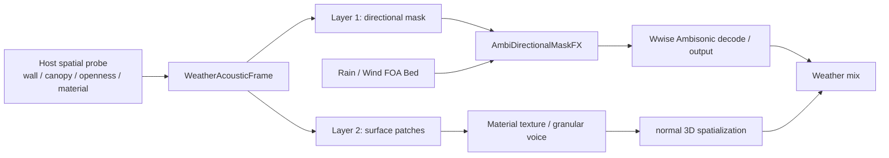

# v0.4 Listener-Centered FOA Weather Field 方案

## 文档状态

- 状态：设计与 POC 计划；**尚未实现**。
- 目标：在保留 v0.3 高质量雨/风素材与局部材质算法资产的前提下，建立以 Listener 为中心的天气声场。它解决远景雨、风和环境底噪在墙边、雨棚下、半开放空间中的整体衰减、频谱变化与方向变化。
- 范围：Wwise FOA Bed、方向遮罩 Effect、局部材质 Patch、宿主运行时数据协议、POC 验收。
- 非目标：逐雨滴 Wwise Event、全场三角网格声学、CFD、有限元、精确门窗衍射、替代 Wwise Spatial Audio Rooms/Portals。

当前可运行交付仍为 v0.3：Stereo Audio File Source/streamed loop 加 `PluginID=31002` Geometry Effect。v0.4 不宣称该 Effect 已可处理 Ambisonics；它定义下一条实现路径与迁移边界。

## 1. 设计结论

天气声拆为两层，使用同一份 Listener 周围的 `WeatherAcousticFrame`，但在 Wwise 中保持独立的声音路径：



1. **Layer 1 — Far Field Bed**：一条或少量 FOA 声场表达大范围、连续到达的雨、风、城市底噪。墙、顶棚和开口只改变方向带上的能量与频谱，不能把单个录音中的独立声源重新分离。
2. **Layer 2 — Material Sound Texture**：顶部雨伞、雨棚、近处金属板、树叶和积水等局部物体，生成少量统计颗粒/纹理声。它提供“雨正在打在这个材质上”的因果感。
3. **Layer coupling**：遮蔽增加时，Layer 1 的相应方向（尤其顶半球）变弱/变闷，同时 Layer 2 的 `ImpactDensity` 与 `ImpactEnergy` 上升。两层由同一帧和同一套调音曲线驱动，避免躲到雨棚下反而整体突然变响。

这不是“反向模拟整个世界”，而是 Listener-local 的感知近似：把有限预算投入玩家此刻能听到的方向变化与近处材质响应。

## 2. Wwise Authoring 结构

```text
Actor-Mixer Hierarchy
  AMB_Weather
    Rain_Far_FOA                  (loop / streaming AmbiX asset)
    Wind_Far_FOA                  (loop / streaming AmbiX asset)
    Rain_Surface_Impacts          (material Switch / granular source)
    Rain_Edge_Drips               (ordinary sparse 3D one-shots)

Master-Mixer Hierarchy
  Master Audio Bus
    Ambience
      Weather
        Rain_Far_FOA_Bus          [AmbiDirectionalMaskFX: rain profile]
        Wind_Far_FOA_Bus          [AmbiDirectionalMaskFX: wind profile]
        Rain_Surface_Bus
        Rain_Drips_Bus
```

### 2.1 Far Field FOA Bed

- 使用真实 FOA AmbiX/ACN/SN3D 素材，或以可验证的方向 Stem 生成 FOA；普通 Stereo WAV 不能凭“转成四声道”获得真实方向信息。
- Sound 采用 `3D Position + Orientation`、`Spread = 100%`，输出到一阶 Ambisonic Bus。`Spread` 保持 100%，避免声场收缩成点声源。
- Host 为 Bed 保留一个专用 proxy：位置随主 Listener 更新，朝向维持录音/世界参考方向。其职责是让 Wwise 的声场旋转与 Listener 朝向一致，而不是表现一个真实点声源。
- 雨、风、城市等需要不同遮挡语义时使用各自的 Bus/Effect 实例。Bus 中已经混合的内容无法在 Effect 内重新识别来源。
- POC 只做 FOA（4 通道）。HOA 不是本阶段承诺；Effect 必须读取并验证实际 `AkChannelConfig`，非法格式安全旁路。

### 2.2 `AmbiDirectionalMaskFX`

该插件是新的 **FOA-safe Bus Effect**，职责仅为在 Ambisonic 域改变方向能量和三段频谱，不生成材质撞击。

```text
Input:  FOA ACN/SN3D buffer + latest directional mask frame
DSP:    precomputed FOA projection matrix + low/mid/high gains + smoothing
Output: FOA ACN/SN3D buffer
```

- 每帧最多两个宽方向遮罩；每个遮罩包含单位方向、角宽、低/中/高频增益与淡入/淡出权重。
- Host 以 10–20 Hz 或“数据有变化时”发送最新状态；音频线程只交换无锁 POD 快照，并在 block 内平滑。不得在音频线程做几何查询、内存分配或锁等待。
- RTPC 仅用于设计师标量：总 Wet、全局遮挡强度、滤波风格、过渡时间、旁路。方向数组使用 Plugin Custom Game Data，不拆成大量 RTPC。
- 输入无数据、数据版本不兼容或数据过期时，Effect 回退到透明输出或明确的开放场预设；不得保留未定义的旧掩码。

### 2.3 坐标链 P0 门禁

方向遮罩计划使用 **Listener-local** 坐标，但这只有在 Effect 收到的 FOA 输入也处于同一坐标系时才正确。不能靠 Bus/Source 的名称假定处理顺序。

POC 必须使用一个单方向 FOA 测试信号完成下列验证：

1. Listener 不旋转时，遮罩压制目标来向。
2. Listener 旋转 90° 时，世界固定声场仍来自正确方向。
3. 游戏侧转换后的 Listener-local 遮罩仍压制同一世界墙体方向。

若 Bus Effect 输入在 Wwise 旋转前，则改为发送与输入一致的源/世界坐标，或调整 Effect 插入位置；不得通过额外旋转“猜测修正”。

## 3. Layer 2：局部材质 Patch

局部物体不需要显式生成大量雨点 Emitter。一个 Patch 是一个聚合发声面，持续输出统计纹理：

| 场景 | POC Patch 数 | 推荐实现 |
| --- | ---: | --- |
| 雨伞或小顶棚 | 1 | Mono 3D material loop / granular voice |
| 大雨棚 | 1–4 | 按材质、距离和方向聚合 |
| 墙边滴水、排水沟 | 1–2 | 普通 3D sparse emitter |
| 远景屋顶群 | 0 | 只进入 FOA Bed |

每个 Patch 包含：`patchId`、材质/Response Profile、世界位置与法线、有效面积、`rainFlux`、`coverage`、`impactEnergy`、优先级和生命周期标记。Host 负责更新其 Wwise proxy 位置；插件只消费紧凑参数。

第一阶段不新建 Source Plugin：使用 Wwise Material Switch、Random/Blend Container 与少量循环材质纹理，驱动 `ImpactDensity`、`ImpactEnergy`、`SurfaceCoverage` 和 `Material`。这样先验证“底雨衰减 + 顶棚撞击增强”的混音是否可信。

当 POC 确认需要更连续的颗粒控制后，再实现 `WeatherSurfaceGranulatorSource`：每个活跃 Patch 一条 Mono voice，内部从有限统计 grains 与共振滤波生成纹理，由 Wwise 正常 3D 空间化。高雨量时过渡到连续纹理；绝不按真实雨滴数创建声音或 PostEvent。

## 4. 现有 v0.3 插件的迁移边界

`PluginID=31002` 可继续服务于 v0.3 的 Stereo/普通多声道 Geometry Wet Response POC，但**不能直接挂到 FOA Bus**。当前 Core 对两个及以上通道只把 wet response 写到通道 0/1；FOA 的通道并不是 L/R，因此会破坏球谐声场。

v0.4 的复用原则：

- 可复用：雨滴随机分布、材质 Profile、modal/resonant filters、ABI/Bank/Native Host 测试方法、Authoring smoke 基础设施。
- 不可直接复用：31002 的 Stereo wet 输出路由、固定 8 Sphere 的场景语义、把输入 Bed 分析结果直接混入 0/1 通道的做法。
- 新增：`AmbiDirectionalMaskFX`（FOA Bus Effect）；必要时新增 `WeatherSurfaceGranulatorSource`（Mono Surface Source）。

v0.4 的 Plugin/Company ID 必须在正式发布前取得 Audiokinetic 分配的唯一值；不得沿用开发期 ID 对外分发。

## 5. `WeatherAcousticFrame` 与宿主边界

```text
Host spatial probe / game geometry
  -> WeatherAcousticFrame (bounded, versioned POD)
  -> Wwise Plugin Custom Game Data
  -> AmbiDirectionalMaskFX

Host patch manager
  -> 1..4 patch parameters + proxy positions
  -> material loop / WeatherSurfaceGranulatorSource
```

建议帧结构：

```text
Header: schema, sequence, timestamp, flags
Bed:    global rain/wind intensity, enclosure scalar, up to 2 directional masks
Patch:  up to 4 material patches (profile, flux, energy, coverage, priority)
```

- 几何系统可以自行使用射线、房间、Collider、预烘焙 Probe 或语义标签，但只向音频发送结果；不发送 Mesh、Collider、三角形、房间图或每次射线命中。
- Host 持有长期状态、数据去重、生命周期、重试与过期处理；Wwise 插件只消费最后一份已验证数据。
- Project_J 集成时，状态属于 `AudioRuntime` Store/Processor，原生调用封装在 `AudioWwiseBridge`，并使用 `AudioProxyObject`/proxy ID。不得把玩法状态放进 proxy，也不得修改 Wwise 生成 C# 包装器。
- `SendPluginCustomGameData` 的 Bus ID、Bus Object ID、Effect 实例定位以及无数据/跨场景/Listener 切换复位语义，是 POC 前必须实测锁定的合同。

## 6. 调音规则

`SkyExposure` 或顶半球遮挡不是单一音量开关。建议由设计师维护曲线：

```text
canopy coverage ↑
  -> upper-direction rain Bed: mid/high attenuation ↑
  -> global far-field rain: small gain reduction
  -> local canopy Patch: density / energy ↑
  -> final Weather Bus: loudness guard / make-up gain by profile
```

墙边、峡谷、室内门口也复用同一方向场机制，但雨、风、城市声使用各自的频谱曲线：风可保留较多低频泄漏，雨通常优先削高频与瞬态，城市声取决于其方向 Stem/FOA 素材。材质 Patch 只适用于有天气激励的局部物体，不应为所有环境声强行生成。

## 7. POC 阶段与验收

| 阶段 | 交付 | 必须证明 |
| --- | --- | --- |
| A | 离线 FOA 掩码 DSP | 方向抑制、三段滤波、能量稳定、无 NaN |
| B | Wwise `AmbiDirectionalMaskFX` shell | 合法 FOA 格式、旁路、SoundBank、Authoring/Native Host 加载 |
| C | 一条 `Rain_Far_FOA` | 旋转坐标链、墙边与雨棚下平滑变化 |
| D | 一条 Metal/Cloth Patch loop | Bed 变闷/变弱与材质纹理增强同步且不过响 |
| E | Windows Project_J adapter | Custom Game Data 定位、proxy 生命周期、场景切换复位 |
| F | A/B 决策 | 对比 2D Bed、4–8 Directional Stem 和 FOA 遮罩的听感、Voice 与 CPU |

POC 通过条件：

- 单墙、墙角、顶部雨棚、离开遮挡物四种状态无 click/pop、无明显左右翻转。
- FOA 路径在耳机 HRTF 与至少一种扬声器解码下均完成 A/B 录音与主观评审。
- Layer 1 + Layer 2 的总响度变化由设计曲线控制，不依赖偶然的叠加增益。
- 音频线程零动态分配、零游戏线程锁；方向矩阵只在数据变更时重算。
- 每个 Effect/Source instance 的 CPU、控制更新率、voice 数和峰值内存以 Wwise Profiler 实测记录，不预设未经验证的预算数字。

停止条件：若一个或两个宽方向遮罩没有稳定可感知收益，或 FOA 染色/跨平台维护成本不能接受，则回退到 4–8 个 Directional Stem 加普通 Wwise RTPC；Layer 2 的局部材质 Patch 仍可保留。

## 8. 构建、发布与文档边界

- Wwise 插件源、Authoring XML、各平台 Runtime DLL/so/a 与 BuildDll 输出必须按目标 Wwise SDK 重新构建；不得把 v0.3 的 Windows DLL 当作 v0.4 或跨版本二进制。
- 每次接入前确认 Host/Wwise SDK 的精确版本，重新跑 Core、Bank ABI、Authoring smoke、Native Host 和目标 Player 加载测试。
- 公开发布前确认测试音频、WEM、截图与第三方素材的再分发许可；当前 Envato preview 测试资产不自动等同于公开发行授权。
- `Build/`、`Artifacts/`、Wwise `.cache/` 与用户 `.wsettings` 是验证或本机状态，不是 v0.4 设计源；发布包只包含明确列入 manifest 的文件。

## 9. 实施前待决项

1. 第一条 FOA 素材是否为可靠 AmbiX/ACN/SN3D，且有可听出上方雨棚差异的能量分布？
2. `AmbiDirectionalMaskFX` 在目标 Wwise 版本的输入坐标系与 Bus Object 定位规则是什么？
3. POC 的最小几何数据源是已有空间 Probe、Physics raycast 还是手工测试 Volume？
4. 第一版是否仅支持一个主 Listener 和全局单实例 Bed Bus？
5. Layer 2 的第一批材质是否限定为 Metal 与 Cloth，以便先验证雨棚/雨伞？
6. Windows POC 通过后，Android/iOS/OpenHarmony 的原生插件与打包验证顺序是什么？

这些问题只决定 POC 的具体范围，不改变“两层、Listener-centered、有限 Patch、FOA Bed 优先验证”的总方向。
