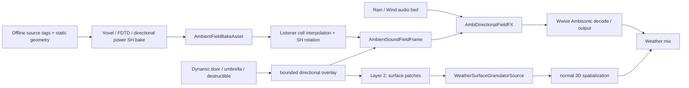

# v0.4 Listener-Centered Baked Ambient Field + Ambisonic Weather 方案

## 文档状态

- 状态：v0.4 **唯一权威设计与 POC 执行计划**；尚未实现。
- 最后更新：2026-08-01（Asia/Shanghai）。
- 目标：在保留 v0.3 高质量雨/风素材与局部材质算法资产的前提下，以 SIGGRAPH Asia 2018 *Ambient Sound Propagation* 的离线方向功率场为静态主层，建立以 Listener 为中心的天气声场。它解决远景雨、风和环境底噪在墙边、雨棚下、半开放空间中的整体衰减、频谱变化与方向变化。
- 范围：扩展声源体素/FDTD/Probe Bake、运行时方向功率插值、Wwise FOA/HOA Bed Effect、动态方向覆盖、局部材质 Patch、宿主数据协议、POC 验收。
- 非目标：逐雨滴 Wwise Event、全场三角网格声学、CFD、有限元、精确门窗衍射、替代 Wwise Spatial Audio Rooms/Portals。

当前可运行交付仍为 v0.3：Stereo Audio File Source/streamed loop 加 `PluginID=31002` Geometry Effect。v0.4 不宣称 Bake 工具或新 Renderer 已经存在，也不宣称该 Effect 已可处理 Ambisonics；它定义下一条实现路径与迁移边界。

| 能力 | 当前事实（v0.3） | v0.4 计划 | 证据/真源 |
| --- | --- | --- | --- |
| 远景雨/风 Bed | Audio File Source/streamed loop + Stereo/普通多声道 Effect 31002 | 每个扩展声源独立 Bake；论文 Renderer 基准与 Ambisonic 产品 Renderer | 本文；v0.3 行为见代码、测试和 `VALIDATION_REPORT.md` |
| 静态空间响应 | 最多 8 个显式 SphereProxy，运行时提交 | 离线 FDTD + Probe Grid + 三阶方向功率 SH | 本文 |
| 动态遮挡 | 由现有 Geometry 场景近似 | 最多两个有界方向 Overlay 或少量 Bake Variant | 本文 |
| 局部材质雨击 | 31002 的输入驱动 Wet Response | 有限 Surface Patch；正式版每 Patch 一条 `WeatherSurfaceGranulatorSource` voice | 本文 |
| 引擎集成 | Native Host 已验证；Unity/Unreal Adapter 未实现 | 引擎无关 Host contract；Project_J 只作为后续可选 Adapter | 本文 |

文档归属规则：本文件描述 v0.4 的架构、数据合同、执行顺序与停止条件；`PRODUCT_PLAN.md` 只记录产品决策历史；v0.3 已实现事实以代码、测试和 `VALIDATION_REPORT.md` 为准。Project_J 工程不再保存本方案副本。

## 1. 设计结论

天气声仍拆为两条听感层，但 Layer 1 的静态空间结果改为 **Bake-first**：



1. **Layer 1 — Baked Far Field**：每个可独立调节的扩展声源分别 Bake 一份静态方向功率场；运行时在 Listener 位置插值并驱动一条普通 WAV/streamed Bed。墙、顶棚和开口改变方向能量，但不能把已经混合的不同扩展声源重新分离。
2. **Layer 2 — Material Sound Texture**：顶部雨伞、雨棚、近处金属板、树叶和积水等局部物体，生成少量统计颗粒/纹理声。它提供“雨正在打在这个材质上”的因果感。
3. **Dynamic overlay**：动态门、雨伞、移动平台和可破坏物不重新运行 FDTD，而是向 Bake 基础场叠加一至两个宽方向覆盖，或在大拓扑变化时切换 Bake Variant。
4. **Layer coupling**：遮蔽增加时，Layer 1 的相应方向变弱；如果有多频带 Bake 或设计化覆盖则同时变闷。Layer 2 的 `ImpactDensity` 与 `ImpactEnergy` 上升，两层共享调音曲线和总响度保护。

论文方法可以作为离线主干，但不能原样当成 FOA 插件：它输出的是三阶方向**功率** SH 场，论文运行时用 Mono 代表素材和四频段 HRTF 功率计算 Stereo 双耳增益，并不输出 FOA 音频。v0.4 因此保留一个论文忠实的耳机 POC，同时把 FOA/HOA Renderer 明确标记为产品扩展。

关键 Bake 修正：源体素不是持续播放同一个固定噪音；同一扩展声源的每个源体素使用彼此独立的带限随机激励，一次 FDTD 同时传播整个扩展源。Probe 也不是关卡里手摆的大量对象，而是对 Listener-valid 空间生成的规则参数 Grid，运行时对相邻八个顶点三线性插值。

## 2. Wwise Authoring 结构

```text
Actor-Mixer Hierarchy
  AMB_Weather
    Rain_Far_Field                (Mono loop; recommended product carrier)
    Wind_Far_Field                (Mono loop; recommended product carrier)
    Rain_Far_Ambi_Carrier         (optional diffuse AmbiX A/B path)
    Rain_Surface_Impacts          (material Switch / granular source)
    Rain_Edge_Drips               (ordinary sparse 3D one-shots)

Master-Mixer Hierarchy
  Master Audio Bus
    Ambience
      Weather
        Rain_Far_Field_Bus        [AmbiDirectionalFieldFX: RainGround bake]
        Wind_Far_Field_Bus        [AmbiDirectionalFieldFX: WindField bake]
        Rain_Surface_Bus
        Rain_Drips_Bus
```

### 2.1 Far Field Bed 与 Bake Source Identity

- 远景音频仍由 Wwise `Audio File Source`/streamed loop 提供；不新增用于 Bed 的 Source Plug-in。Bake 资产描述传播方向与能量，不负责合成原始雨/风素材。
- 当前产品路径优先使用干净的 Mono 代表 loop，由 out-of-place `AmbiDirectionalFieldFX` 生成去相关 FOA/HOA。经验证的 diffuse FOA/HOA carrier 保留为可选模式；任意实录 AmbiX 若包含强方向事件，再乘 Bake 场会产生双重方向编码。普通 Stereo WAV 也不能凭复制/重排声道获得可控 diffuse 声场。
- Mono 模式作为 Listener-centered Bed 路由，不依赖点声源距离衰减；Effect 负责生成目标 Ambisonic channel config。可选 Ambisonic carrier 模式才要求保持合法 ACN/SN3D、`Spread = 100%` 和明确的录音参考朝向。
- Host 为每个 Bed/source identity 保留专用 Wwise object/proxy，用于 Effect 实例定位、Listener 路由、坐标约定与场景复位；它不是世界中的真实雨点 Emitter。proxy 是否必须跟随 Listener，以及 Bus Effect 位于 Wwise 声场旋转前还是后，由坐标链 P0 实测决定。
- 雨地面、雨屋顶、水面、海浪、风和城市等需要独立响度/传播时，各自使用 `sourceId + Bake Asset + Bus/Effect instance`。Bus 中已经混合的内容无法在 Effect 内重新识别来源。
- Phase D 可先以 FOA（4 通道）打通 Effect shell，再在同一场景比较 HOA2/HOA3；当前质量目标是 HOA3，是否最终降阶由听感和成本门决定。目标 order 在 voice/Bus 初始化时冻结，不在播放中动态切换。Effect 必须读取并验证实际 `AkChannelConfig`，非法格式安全旁路。

### 2.2 `AmbiDirectionalFieldFX`：产品路径

该插件是新的 **out-of-place Ambisonic Bus Effect**，职责是把 Mono 代表素材生成去相关方向分量并按 Bake 场编码，或对已有 FOA/HOA carrier 应用方向场；它不生成材质撞击。该渲染是论文数据模型到 Wwise 通用输出链的扩展，不是论文原始双耳算法。

```text
Recommended input: Mono carrier -> fixed-capacity multiband decorrelation
Optional input:    same-order FOA/HOA ACN/SN3D diffuse carrier
Shared control:    interpolated directional power SH + dynamic overlay
DSP:               power reconstruction -> sqrt amplitude -> Ambisonic projection -> smoothing
Output:            configured FOA/HOA ACN/SN3D buffer
```

- Bake 基线每个源包含 `loudnessDb + 16` 个三阶实 SH 方向功率系数；高阶系数按 DC 归一化。Effect 重建功率时使用窗口和非负下限，再以平方根转换为振幅。
- 每帧最多附加两个动态宽方向遮罩；每个遮罩包含单位方向、角宽、低/中/高频增益与淡入/淡出权重。
- Host 以 10–20 Hz 或“数据有变化时”发送最新状态；音频线程只交换无锁 POD 快照，并在 block 内平滑。不得在音频线程做几何查询、内存分配或锁等待。
- RTPC 仅用于设计师标量：总 Wet、全局遮挡强度、滤波风格、过渡时间、旁路。方向数组使用 Plugin Custom Game Data，不拆成大量 RTPC。
- 输入无数据、数据版本不兼容或数据过期时，Effect 回退到透明输出或明确的开放场预设；不得保留未定义的旧场。
- Bake 控制场是三阶不代表 FOA 输出获得三阶空间分辨率。POC 必须对比 FOA、二阶 HOA 和三阶 HOA，记录通道数、染色与 CPU。
- Mono 模式不能把同一信号直接复制到多个方向/声道，否则会产生强相干、声场坍缩与梳状染色。去相关器的延迟、能量守恒、Mono compatibility、音色与跨平台成本必须单独测试；可选 carrier 模式则跳过去相关，只应用同阶方向矩阵。

### 2.3 `AmbientPowerFieldRendererFX`：论文忠实基准

为先验证 Bake 本身，增加一个受限 POC：

```text
Mono representative loop
  -> out-of-place Bus Effect
  -> four HRTF power bands (125 / 600 / 2400 / 9600 Hz)
  -> Stereo binaural output
```

它将 Listener-local 方向功率 SH 与左右耳 HRTF 功率 SH 做内积，得到各频带耳朵能量，取平方根作为振幅增益。该路径最接近论文，但只作为耳机基准：不保留 Ambisonic 输出，不承担扬声器解码，也忽略论文未建模的精确耳间相位。

本地 Wwise 2023.1 SDK 表明，改变输入/输出通道配置需要 out-of-place Effect；`SendPluginCustomGameData` 明确按 Bus ID、Bus Object ID 和插件 ID 定位 Bus 上的 Effect/Mixer。因此远景场默认使用专用 Bus Effect，不把它误称为 `Weather...Source`。只有 Layer 2 的 `WeatherSurfaceGranulatorSource` 是 Source Plug-in。

### 2.4 Renderer 路线比较与当前推荐

方向功率场只描述“能量从哪些方向到达”，并不限定最终音频一定是 Mono、FOA 或 Stereo。可选 Renderer 的理论上限、产品适用性和成本不同：

| 路线 | 输出 | 优势 | 主要限制 | v0.4 定位 |
| --- | --- | --- | --- | --- |
| 多方向去相关分量 -> 完整 HRIR 卷积 | Stereo binaural | 耳机条件下理论空间线索最完整，可保留方向相关 ITD/IPD 与频谱 | 方向数、卷积与 HRIR 数据成本高；扬声器/平台泛化差 | 质量上限参考，不作为首个 POC |
| 论文四频带功率 Renderer | Stereo binaural | 最接近论文，链路短，最适合判断 Bake 数据是否有价值 | 只计算耳朵能量增益，不保留精确相位/时延，不是通用空间格式 | **Phase C 首个基准** |
| Mono -> 去相关 HOA3 -> Wwise decode | HOA3，16 通道 | 方向分辨率最高的通用产品候选，耳机和扬声器统一交给 Wwise | 去相关音色、16 通道矩阵和解码成本需实测 | **`AmbiDirectionalFieldFX` 当前产品质量目标** |
| Mono -> 去相关 HOA2 / FOA | HOA2 9 通道 / FOA 4 通道 | 成本较低、跨平台更容易；同一数据链可降阶 | 阶数越低方向平滑越强，FOA 尤其难表达窄开口 | 产品成本档 |
| 4–8 个 Directional Stem | 多条 Mono/Bus | 可观测、易调试，可直接利用 Wwise 3D/遮挡链 | 方向量化、voice/Bus 数增加，跨区淡化复杂 | 工程回退方案 |
| Diffuse FOA/HOA carrier -> 场矩阵 | 同阶 Ambisonics | 不需实时把 Mono 扩展成声场，Effect 形态简单 | 依赖合格的 diffuse carrier；原素材方向性会与 Bake 双重编码 | A/B 对照，验证后才可产品化 |

当前顺序不是直接在 FOA 与 Stereo 中二选一：先用论文 Mono->Stereo 路径隔离验证 Bake；Bake 通过后，再用同一 Listener 轨迹比较 HOA3、HOA2、FOA、Directional Stem 和 diffuse carrier。若 HOA3 的收益不足以覆盖 16 通道成本，则降到 HOA2；FOA 是最低成本档，不因实现最简单而默认代表最佳效果。

对 FOA/HOA 输入场，方向增益的概念处理为：

```text
E(Ω) = Σ c_lm Y_lm(Ω)
g(Ω) = sqrt(max(E(Ω), ε) / referencePower)
M_pq = ∫ Y_p(Ω) g(Ω) Y_q(Ω) dΩ
output_p = Σ M_pq input_q
```

`c_lm` 是三阶方向**功率**系数，先重建并限制为非负功率，再开方得到振幅方向函数。矩阵 `M` 只在控制帧变化时通过固定球面采样/预计算 Gaunt 项更新，并在音频 block 间平滑；不得逐 sample 重建。控制场为三阶不代表输出必须是 HOA3：当输出是 FOA/HOA2 时，矩阵投影会截断方向细节，正是 Phase D 必须 A/B 的内容。

### 2.5 坐标链 P0 门禁

Bake 资产以世界坐标保存方向功率 SH；运行时插值后旋转到 **Listener-local**。动态遮罩也使用 Listener-local，但这只有在 Effect 收到的 Ambisonic 输入处于同一坐标系时才正确。不能靠 Bus/Source 的名称假定处理顺序。

POC 必须使用一个单方向 FOA 测试信号完成下列验证：

1. Listener 不旋转时，遮罩压制目标来向。
2. Listener 旋转 90° 时，世界固定声场仍来自正确方向。
3. 游戏侧转换后的 Listener-local 遮罩仍压制同一世界墙体方向。

若 Bus Effect 输入在 Wwise 旋转前，则改为发送与输入一致的源/世界坐标，或调整 Effect 插入位置；不得通过额外旋转“猜测修正”。

### 2.6 Offline Bake 与运行时资产

每个可独立控制的扩展声源按下列流水线生成一份 `AmbientFieldBakeAsset`：

```text
source surface / volume tags
  -> static scene voxelization
  -> independent band-limited stochastic signal per source voxel
  -> one FDTD simulation for the whole extended source
  -> streaming time-averaged directional flux accumulation
  -> real SH projection (order 0..3, 16 coefficients)
  -> regular listener-valid probe grid
  -> quantization / chunk compression / asset streaming
```

资产至少包含：`sourceId`、场景/Bake 版本、Grid 原点和 Cell 尺寸、维度、有效顶点、每顶点 `loudnessDb`、归一化方向功率 SH、量化范围和压缩块索引。运行时定位 Cell，读取相邻八个顶点，对响度和每个 SH 系数分别三线性插值，然后旋转到 Listener-local 并发送给 Effect。

论文示例把 Listener 空间降采样到约 `1 m` Cell，并将总响度限制在 `[-60, 6] dB`；v0.4 把这些作为初始实验值，不冻结为产品常量。每源资产的 Bake 时间、峰值内存、压缩尺寸、插值误差和运行时缓存命中率必须实测。

论文只烘焙一份宽带传播场。四个 HRTF 频段只是双耳头部阴影，不等于墙体/材质的频率相关传播。若产品要求“墙后高频更闷”，有两种明确路径：

- POC：在动态覆盖层用设计化三频段衰减，标记为感知近似。
- 正式扩展：Bake 多个传播频带，每个频带独立保存方向功率场；成本按频带数增加。

静态声源形状、位置和场景拓扑都被冻结在 Bake 中。动态大门可用少量开/关 Bake Variant，雨伞和小型移动遮挡用运行时覆盖；移动的大范围风场或水面若不能接受变体成本，不适合直接套用该离线方法。

## 3. Layer 2：局部材质 Patch

`Surface Patch` 是 Host/Game 侧维护的**聚合表面数据与生命周期单位**，不是某一种 Wwise 插件，也不等于一滴雨或一个物理粒子。一个活跃 Patch 最终对应一条持续的 Wwise Mono voice；该 voice 内部可以生成很多统计 Grain，但 Wwise 只管理这一条 voice。

职责边界：

| 层 | 负责 | 不负责 |
| --- | --- | --- |
| Host/Game spatial probe | 发现附近表面，计算材质、代表位置/法线、有效面积、覆盖度和雨量 | 逐滴 PostEvent、PCM 合成 |
| Runtime patch manager | Patch 聚合、Top-K 选择、proxy/playing ID 生命周期、参数去重与平滑 Stop | 音频 block 内随机颗粒 |
| `WeatherSurfaceGranulatorSource` | 根据 Patch 参数调度 Grain、材质瞬态/共振并输出 Mono PCM | 查询 Mesh/Collider、移动 Wwise emitter |
| Wwise | Voice、3D 定位、距离衰减、混响、遮挡、Bus 混音 | 判断哪个游戏表面正在被雨击中 |

局部物体不需要显式生成大量雨点 Emitter。Patch 数量按感知贡献而不是几何细分决定：

| 场景 | POC Patch 数 | 推荐实现 |
| --- | ---: | --- |
| 雨伞或小顶棚 | 1 | Mono 3D material loop / granular voice |
| 大雨棚 | 1–4 | 按材质、距离和方向聚合 |
| 墙边滴水、排水沟 | 1–2 | 普通 3D sparse emitter |
| 远景屋顶群 | 0 | 只进入 FOA Bed |

每个 Patch 包含：`patchId`、材质/Response Profile、世界位置与法线、范围/有效面积、`rainFlux`、`coverage`、`impactEnergy`、优先级、稳定随机种子和生命周期标记。Host 负责更新其 Wwise proxy 位置；插件只消费紧凑声学参数。

对于宽雨棚或长屋顶，Host 将 Listener 附近区域聚合为最多 2～4 个 Patch，并随 Listener 移动维护一个滑动 Active Set：

- 优先保留距离近、有效迎雨面积大、材质差异明显和方向可区分的区域。
- Patch 边界变化时复用既有 proxy/voice，并交叉淡化参数；不得因为跨过空间网格边界而重新 Post 一批声音。
- 每个活跃 Patch 使用独立 Seed，避免多个位置播放完全相关的随机序列。
- 屋檐滴水、排水沟和板件拍击等可定位强特征使用独立 Sparse Emitter，不混进均匀屋顶 Grain。
- 不优先用 MultiPosition 把同一条 Grain 序列复制到多个点；面积决定密度/厚度，多个可分辨区域才拆成独立 Patch voice。

### 3.1 POC 与正式渲染路径

| 阶段 | Wwise 路径 | 用途与限制 |
| --- | --- | --- |
| 最快 POC | Audio File Source / Random / Blend Container + Material Switch/RTPC | 不写新插件，先验证 Bed 衰减和材质纹理叠加是否可信 |
| v0.3 复用 POC | Mono rain carrier -> Effect 31002 -> Wwise 3D | 可复用既有材质算法，但每个 Patch 仍需要输入 carrier，且不能用于 FOA Bus |
| 正式方案 | `WeatherSurfaceGranulatorSource` -> Mono PCM -> Wwise 3D | Patch 独立随机、连续密度控制、无需复制 Bed，作为 v0.4 目标实现 |

POC 可以推迟 Source Plug-in 的开发，但正式架构不把局部材质声建立在 FOA Bed 的输入分析上。Baked Bed 表达远场，Surface Source 表达近场被激励表面，两者由 Runtime 的天气强度、动态覆盖和总响度曲线联动。

### 3.2 `WeatherSurfaceGranulatorSource` 的 Wwise 含义

这是 Wwise **Source Plug-in**，不是 Audio Input，也不是接收一段雨声再处理的 Effect。它被放在一个持续 Sound 对象中：

```text
Play_RainSurfacePatch
  -> RainSurfacePatch_Sound
      -> WeatherSurfaceGranulatorSource   (infinite/continuous Mono source)
          -> Rain_Surface_Bus
```

一个 Source 实例就是一个活跃 Patch 的 Wwise voice。Patch 激活时 Runtime 对其 proxy Post 一次；随后只更新参数与位置。Patch 退出时平滑降低密度/增益并 Stop/回收。雨量变化、材质参数变化和 Listener 移动不应反复重启 Event。

插件输出 Mono，让 Wwise 根据 Patch proxy 的位置完成 3D 空间化。`worldPosition`、方向、距离和最终遮挡不需要进入颗粒合成器；这些属于 Wwise emitter/listener 路由。Source 只需要材质、面积、雨量、覆盖度、撞击能量、Seed 和调音参数。

### 3.3 每个音频 Block 的颗粒算法

每个 render block 的概念处理如下：

```text
excitation = rainFlux * effectiveArea * coverage
grainRate  = profileDensityCurve(excitation)

accumulator += grainRate * blockDuration
while accumulator crosses a scheduled grain:
    select recorded/procedural grain with deterministic RNG
    randomize onset, velocity, pitch, gain and micro-timing
    start material transient + resonant response

mix all active grains
apply density saturation / continuous-texture crossfade
apply output smoothing and safety limiting
write one Mono PCM block
```

这里的“合成”推荐采用 **录音 Grain + 程序化调度 + 材质共振**，而不是只用噪声/正弦波假造所有撞击：

- Grain 库提供金属、布、玻璃、瓦片、树叶等真实瞬态质感，可作为插件媒体随 SoundBank/发布清单打包。
- 程序化调度负责雨量连续变化、随机时刻、力度、音高、密度饱和和稳定 Seed。
- Material Exciter 与少量 modal/resonant filters 表达薄板振铃、布面吸收、玻璃窄带共振等结构差异。
- 低雨量保留可分辨的离散撞击；高雨量平滑过渡到连续纹理，避免同一 block 内维护无界 Grain 数。

Grain 是插件内部的轻量播放单元，不是 Wwise voice。无论一秒调度多少虚拟雨滴，一个 Patch 对 Wwise 仍只消耗一条 voice。

### 3.4 参数与数据通路

建议参数分为三类：

| 类型 | 示例 | 通路 |
| --- | --- | --- |
| Authoring/Profile 静态值 | Grain 集、共振频率/阻尼、密度曲线、随机范围 | Plug-in Property / SoundBank |
| Patch 动态标量 | `rainFlux`、`effectiveArea`、`coverage`、`impactEnergy`、Seed、Gain | Game Object-scoped RTPC、参数更新或验证后的 Custom Game Data |
| 空间状态 | proxy 位置/朝向、listener 路由、距离、遮挡、reverb send | Host `AudioProxyObject` + Wwise 原生空间接口 |

第一版每条 Patch voice 只需要标量动态参数，不需要把整个 Patch 数组塞进单个 Source 实例。Runtime patch manager 将 Patch 绑定到各自 proxy；`AmbientSoundFieldFrame` 则通过专用 Bus Effect 的 Custom Game Data 独立发送。

### 3.5 音频线程约束与降级

- render 回调不分配内存、不获取 Host/Game 锁、不查询文件系统或 Geometry。
- 每个 Patch 预分配固定最大 Grain voice 数和滤波状态；超量 excitation 通过密度饱和/连续纹理处理，而不是继续扩容。
- Grain 媒体缺失或 Profile 不兼容时回退到安全的程序化 impulse/noise profile 或静音，并上报诊断；不得访问无效媒体。
- Patch 参数过期时平滑衰减，而不是永久维持上一场景的撞击声。
- Source 被 Wwise virtualize/恢复时必须保持时间和随机状态合同，避免恢复时爆发补播积压 Grain。

## 4. 现有 v0.3 插件的迁移边界

`PluginID=31002` 可继续服务于 v0.3 的 Stereo/普通多声道 Geometry Wet Response POC，但**不能直接挂到 FOA Bus**。当前 Core 对两个及以上通道只把 wet response 写到通道 0/1；FOA 的通道并不是 L/R，因此会破坏球谐声场。

v0.4 的复用原则：

- 可复用：雨滴随机分布、材质 Profile、modal/resonant filters、ABI/Bank/Native Host 测试方法、Authoring smoke 基础设施。
- 不可直接复用：31002 的 Stereo wet 输出路由、固定 8 Sphere 的场景语义、把输入 Bed 分析结果直接混入 0/1 通道的做法。
- 新增：离线 `AmbientFieldBake` 工具链、论文基准 `AmbientPowerFieldRendererFX`、产品 `AmbiDirectionalFieldFX`（FOA/HOA Bus Effect）和正式版 `WeatherSurfaceGranulatorSource`（Mono Surface Source）；POC 可先用普通 Wwise 素材或 31002 验证 Layer 2 混音。

v0.4 的 Plugin/Company ID 必须在正式发布前取得 Audiokinetic 分配的唯一值；不得沿用开发期 ID 对外分发。

## 5. `AmbientSoundFieldFrame` 与宿主边界

```text
AmbientFieldBakeAsset + Listener transform
  -> cell interpolation + world-to-listener SH rotation
dynamic geometry semantics
  -> bounded directional overlay
  -> AmbientSoundFieldFrame (bounded, versioned POD)
  -> Wwise Plugin Custom Game Data
  -> AmbiDirectionalFieldFX / AmbientPowerFieldRendererFX

Host patch manager
  -> 1..4 patch parameters + proxy positions
  -> material loop / WeatherSurfaceGranulatorSource
```

建议帧结构：

```cpp
constexpr std::uint32_t kAmbientPowerShCount = 16;
constexpr std::uint32_t kMaxDirectionalOverlays = 2;

struct DirectionalOverlayV1
{
    float directionListener[3];
    float angularWidthRadians;
    float bandGainLinear[3];
    float weight;
};

struct AmbientSoundFieldFrameV1
{
    std::uint32_t schemaVersion;
    std::uint32_t byteSize;
    std::uint64_t sourceId;
    std::uint64_t sequence;
    double timestampSeconds;
    std::uint32_t flags;
    std::uint32_t overlayCount;
    float loudnessDb;
    float normalizedDirectionalPowerSh[kAmbientPowerShCount];
    DirectionalOverlayV1 overlays[kMaxDirectionalOverlays];
};
```

- 这是协议草图而非已冻结 ABI；实现时必须锁定字节序、对齐、`sizeof`、版本兼容与坏包测试。协议内不放指针、容器或宿主对象句柄。
- `normalizedDirectionalPowerSh[0]` 固定为 1，高阶项保存 `E_lm / E_00`；Effect 收到的是已插值、已旋转到约定坐标系的快照。
- 静态几何由 Bake 消化，不进入运行时帧。动态几何系统可以使用射线、Collider 或语义标签生成少量覆盖，但不发送 Mesh、三角形、房间图或每次射线命中。
- 每个需要独立控制的扩展声源使用独立帧与 Bus/Effect 实例；不把多个源混成一个 `sourceId`。
- Surface Patch 生命周期和参数是独立通路，不塞进发给单个 Bed Effect 的场帧。
- Host 持有长期状态、数据去重、生命周期、重试与过期处理；Wwise 插件只消费最后一份已验证数据。
- 核心协议保持引擎无关：Host Adapter 只负责 Bake 资产生命周期、Listener 变换、动态 Overlay、Patch manager、Wwise object 定位与场景复位。Project_J 若后续接入，状态应属于 `AudioRuntime` Store/Processor，原生调用封装在 `AudioWwiseBridge`，并使用 `AudioProxyObject`/proxy ID；这只是可选 Adapter 映射，不是本方案的所有权边界。
- `SendPluginCustomGameData` 的 Bus ID、Bus Object ID、Effect 实例定位以及无数据/跨场景/Listener 切换复位语义，是 POC 前必须实测锁定的合同。

## 6. 调音规则

静态顶半球遮挡优先来自 Bake，不再用单一 `SkyExposure` 代替整套空间场。动态雨伞/临时顶棚覆盖仍由设计师维护联动曲线：

```text
canopy coverage ↑
  -> upper-direction rain Bed: mid/high attenuation ↑
  -> global far-field rain: small gain reduction
  -> local canopy Patch: density / energy ↑
  -> final Weather Bus: loudness guard / make-up gain by profile
```

墙边、峡谷、室内门口的静态响应由各自 Bake 场给出。雨、风、城市声仍可使用不同调音曲线：风可保留较多低频泄漏，雨通常优先削高频与瞬态，但若未启用多频带 Bake，这些差异属于 Renderer/Overlay 的感知设计，不是论文基线的频率传播结果。材质 Patch 只适用于有天气激励的局部物体，不应为所有环境声强行生成。

## 7. POC 阶段与验收

### 7.1 第一条可执行切片

第一条 POC 冻结为“静态地面雨扩展源 + 单墙/门洞 + 单主 Listener 的直线与转向轨迹”。先只做宽带 Bake，不加入动态门、雨伞、Surface Granulator 或多频带传播，以便隔离验证论文数据链。

现有仓库落点优先复用当前结构，不预先拆新产品树：

| 交付 | 计划落点 | 最小产物 |
| --- | --- | --- |
| Bake 数据结构、SH/插值/旋转 | `Core/include/rwwa`、`Core/src` | 版本化资产/帧类型与确定性单元测试 |
| Bake/离线可视化入口 | 扩展 `Tools/OfflineRenderer`，必要时再拆 `Tools/AmbientFieldBake` | CLI 资产、方向球/轨迹 CSV 或图像、性能 JSON |
| 数值与跨 Cell 回归 | `Tests` | 固定小场景 golden/容差测试、坏资产测试 |
| 两个 Runtime Effect | `RealWorldWeatherAcoustics/SoundEnginePlugin` | Phase C Mono->Stereo；Phase D FOA/HOA |
| Authoring 属性与 XML | `RealWorldWeatherAcoustics/WwisePlugin`、`FactoryAssets` | 可创建、可保存、可生成 SoundBank |
| Wwise 集成证据 | `WwiseSmoke`、`Tools/WwiseSmoke` | Custom Game Data、多实例定位、Profiler 与录音 A/B |

Phase A 的停止点是能可视化验证门洞/墙后方向能量且同输入可复现；Phase B 的停止点是 Listener 轨迹连续、插值/压缩误差和资产成本有记录；只有 A/B 通过才实现 Phase C。Phase C 若相对 2D Gain/LPF 基线没有稳定可听收益，则先停止，不进入 Ambisonic 或 Surface Source 开发。

### 7.2 阶段表

| 阶段 | 交付 | 必须证明 |
| --- | --- | --- |
| A | 小场景 Ambient Field Bake | 独立随机源、一次 FDTD、三阶 SH 编码、方向可视化、可复现 |
| B | Bake Asset + Runtime sampler | 八点插值、SH 旋转、压缩/流送、跨 Cell 连续、误差与成本 |
| C | `AmbientPowerFieldRendererFX` | Mono->Stereo out-of-place、论文四频段双耳能量、Custom Game Data 定位 |
| D | `AmbiDirectionalFieldFX` | FOA/HOA 格式、功率到振幅、矩阵平滑、Wwise 耳机/扬声器解码 |
| E | 动态覆盖 + Metal/Cloth Patch loop | 动态门/雨伞与 Bake 合成；Bed 变化和材质纹理增强同步且不过响 |
| F | `WeatherSurfaceGranulatorSource` | Mono Source、稳定 Seed、稀疏到连续密度、材质 Grain/共振与固定容量 |
| G | 引擎无关 Host contract + 一个 Windows adapter | Bake 资产生命周期、Custom Game Data、proxy/playing ID、场景切换复位；Project_J 仅为可选验证宿主 |
| H | A/B 决策 | 对比 2D Bed、论文双耳基准、FOA/HOA Renderer、4–8 Stem；对比 Patch loop 与 Source Plug-in |

POC 通过条件：

- 静态单墙、墙角、门洞、顶部雨棚和 Listener 连续移动轨迹无 click/pop、无明显左右翻转或 Cell 跳变。
- Bake 方向球面、插值误差、压缩误差、每源资产尺寸、Bake 时间和峰值内存都有可复现记录。
- 论文双耳 Renderer 是 FOA/HOA 产品 Renderer 的感知基准；两者差异必须录音并评审，不能只证明插件能加载。
- FOA 路径在耳机 HRTF 与至少一种扬声器解码下均完成 A/B 录音与主观评审。
- Layer 1 + Layer 2 的总响度变化由设计曲线控制，不依赖偶然的叠加增益。
- 音频线程零动态分配、零游戏线程锁；方向矩阵只在数据变更时重算。
- 每个 Effect/Source instance 的 CPU、控制更新率、voice 数和峰值内存以 Wwise Profiler 实测记录，不预设未经验证的预算数字。

停止条件：若 Bake 在代表场景中相对全局 LPF/Gain 没有稳定收益，或 Bake/资产流送成本不可接受，则不进入全量关卡生产。若 Bake 有收益但 FOA/HOA 适配的染色或跨平台成本不可接受，则保留 Bake 数据并回退到论文双耳限定用途或 4–8 个 Directional Stem；Layer 2 的局部材质 Patch 仍可独立保留。

## 8. 构建、发布与文档边界

- Wwise 插件源、Authoring XML、各平台 Runtime DLL/so/a 与 BuildDll 输出必须按目标 Wwise SDK 重新构建；不得把 v0.3 的 Windows DLL 当作 v0.4 或跨版本二进制。
- 每次接入前确认 Host/Wwise SDK 的精确版本，重新跑 Core、Bank ABI、Authoring smoke、Native Host 和目标 Player 加载测试。
- 公开发布前确认测试音频、WEM、截图与第三方素材的再分发许可；当前 Envato preview 测试资产不自动等同于公开发行授权。
- `Build/`、`Artifacts/`、Wwise `.cache/` 与用户 `.wsettings` 是验证或本机状态，不是 v0.4 设计源；发布包只包含明确列入 manifest 的文件。

## 9. 实施前待决项

1. 第一条 Bake POC 已冻结为“静态地面雨源 + 墙/门洞 + 单主 Listener”；扩大场景前先完成 Phase A/B/C 门禁。
2. Bake Solver 选 CPU/GPU FDTD 还是接入现有求解库；其许可证、确定性、断点续算和构建环境是什么？
3. 第一版先复现论文宽带场，还是直接做多频带传播；推荐先宽带，再用 A/B 决定频带数。
4. Probe Cell 尺寸、Listener-valid 空间、无效八邻点和分区流送边界如何定义？
5. 每张地图的独立扩展声源数与 Bake Variant 上限是多少；雨地面、雨屋顶、水面和风场如何拆分？
6. 产品质量目标暂定 Mono -> 去相关 HOA3；HOA2/FOA 是成本档，Directional Stem 是回退，diffuse carrier 是对照。最终阶数仍必须在论文双耳基准通过后按 Phase D A/B 与 Profiler 数据冻结。
7. `SendPluginCustomGameData` 的 Bus Object 定位、跨场景复位以及多个同插件 Bus 实例的唯一性合同是什么？
8. Layer 2 第一批材质是否限定为 Metal 与 Cloth；Windows 通过后 Android/iOS/OpenHarmony 的验证顺序是什么？

这些问题只决定 POC 的具体范围，不改变“Bake 静态主场 + 动态局部覆盖 + 有限 Surface Patch”的总方向。

## 10. 研究与许可边界

- [Ambient Sound Propagation（SIGGRAPH Asia 2018）](https://www.cs.cornell.edu/projects/ambientsound/SAsia-2018-ambient2.pdf) 是 Bake、方向功率 SH 与论文双耳 Renderer 的主要研究依据。
- [论文项目页](https://www.cs.cornell.edu/projects/ambientsound/) 提供论文、视频和演示，但未列出可直接集成的源码仓库；v0.4 不把该方法当作现成 SDK，Solver、编码器和运行时资产都需要独立实现和验证。
- 论文示例的数小时 Bake、GB 级峰值内存、约 MB/扩展声源和约百微秒/帧/源只用于量级参考；产品预算必须在当前硬件、真实关卡和目标平台重新测量。
- 球谐与 Ambisonic 工程可参考 Spatial Audio Framework、SPARTA、ambiX 和 IEM 插件，但 GPL 代码只用于研究；正式复用前单独审核每个模块许可证。
